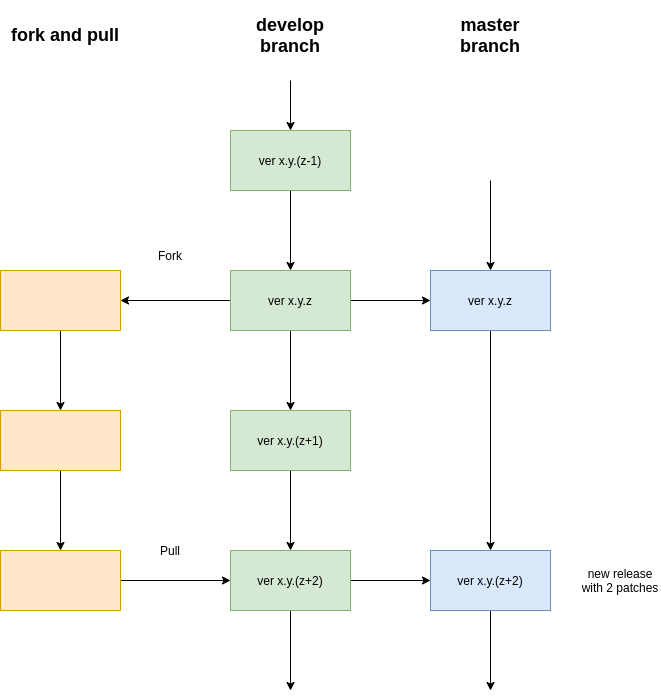

.. _Contribution Guidelines:

Contribution Guidelines
===================================

In this section we report some general guidelines for contributing to ``PAOS`` development.

The section is inspired by the package ExoSim2.0_.

Coding conventions
-----------------------
The ``PAOS`` code has been developed following the PeP8_ standard and the python Zen_.

.. jupyter-execute::

    import this

Documentation
-----------------------
Every ``PAOS`` function or class should be documented using docstrings which follow numpydoc_ structure.
This web page is written using the reStructuredText_ format, which is parsed by sphinx_.
If you want to contribute to this documentation, please refer to sphinx_ documentation first.
You can improve this pages by digging into the `docs` directory in the source.

Testing
-----------------------
Unit-testing is very important to make sure that each code addition is tested and validated and the code never
breaks. This shall be provided after `PAOS v1.0.0`.

.. _logging:

Logging
--------------
To keep a logger is very important when coding, hence we utilize the loguru_ Python package.

Here are some examples of how to use it:

.. code-block:: python

    from paos import logger

    logger.info("info message")
    logger.debug("debug message")
    logger.warning("warning message")
    logger.error("error message")
    logger.critical("critical message")

The logger output will be printed on the run or stored in the log file, if the log file option is enabled.
To enable the log file, the user can refer to :func:`paos.log.logger.addLogFile`.

The user can also set the level of the printed messaged using :func:`paos.log.logger.setLogLevel`, or enable or disable the
messaged with :func:`paos.log.logger.enableLogging` or :func:`paos.log.logger.disableLogging`

Versioning conventions
-----------------------
The versioning convention used (after `PAOS v1.0.0`) shall be the one described in Semantic Versioning (semver_) and shall be compliant to PEP440_ standard.
In the X.Y.Z scheme, for each modification to the previous release we increase one of the numbers.

+ `X`

  increased only if the code in not compatible anymore with the previous version. This is considered a Major change.
+ `Y`

  increased for minor changes. These are for the addition of new features that may change the results from previous versions. This are still hard edits, but not enough to justify the increase of an `X`.
+ `Z`

  the patches. This number should increase for any big fixed, or minor addition or change to the code. It won't affect the user experience in any way.

.. _PEP440: https://www.python.org/dev/peps/pep-0440/

Source Control
------------------
The code is hosted on GitHub (https://github.com/arielmission-space/PAOS) and structured as following.

The source has two main branches:

+ ``main``

  branch for stable and releases. It is the public branch and should be handled carefully.
+ ``develop``

  working branch where the new features are tested before they are moved to the `master` branch

Adding new features
^^^^^^^^^^^^^^^^^^^^^^
New features can be added to the code following the schemes designed above.

If the contributor has writing rights to the repository, should create a new branch starting from the `develop` one.
In the new `feature` branch the user should produce the new functionalities, according to the above guidelines.
When the feature is ready, the branch can be merged into the official `develop` one.

To create the new feature starting from the current develop version, the contributor should run

.. code-block:: bash

    $ git checkout develop
    $ git checkout -b feature/<branchname>

The completed feature shall then be merged to the develop:

.. code-block:: bash

    $ git checkout develop
    $ git merge feature/<branchname>
    $ git push

Once a feature is completed and merged, the contributor should archive the branch and remove it, to keep the repository clean.
The usual procedure is:

.. code-block:: bash

    $ git tag archive/<branchname> feature/<branchname>
    $ git push --tags
    $ git branch -d feature/<branchname>

Remember to delete the branch also from the remote repository.
If needed, the feature branch can be restored as

.. code-block:: bash

    $ git checkout -b <branchname> archive/<branchname>

If the contributor does not have writing rights to the repository, should use the Fork-and-Pull_ model.
The contributor should fork_ the main repository and clone it. Then the new features can be implemented.
When the code is ready, a pull_ request can be raised.

    `Forking and pulling`

.. _ExoSim2.0: https://exosim2-public.readthedocs.io/en/latest/
.. _TauREx3: https://taurex3-public.readthedocs.io/en/latest/
.. _Pep8: https://www.python.org/dev/peps/pep-0008/
.. _Zen: https://www.python.org/dev/peps/pep-0020/
.. _reStructuredText: https://docutils.sourceforge.io/rst.html
.. _sphinx: https://www.sphinx-doc.org/en/master/
.. _numpydoc: https://numpydoc.readthedocs.io/en/latest/
.. _Fork-and-Pull: https://en.wikipedia.org/wiki/Fork_and_pull_model
.. _fork: https://docs.github.com/en/get-started/quickstart/fork-a-repo
.. _pull: https://docs.github.com/en/github/collaborating-with-pull-requests/proposing-changes-to-your-work-with-pull-requests/creating-a-pull-request
.. _semver: https://semver.org/spec/v2.0.0.html
.. _unittest: https://docs.python.org/3/library/unittest.html
.. _decorator: https://realpython.com/primer-on-python-decorators/
.. _actions: https://github.com/features/actions
.. _loguru: https://loguru.readthedocs.io/en/stable/
