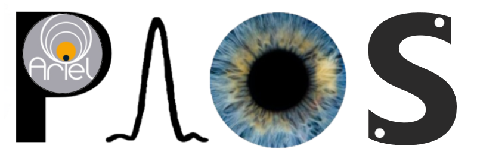

.. _index:

====================================
Welcome to ``PAOS``'s documentation!
====================================

    |image1|

``PAOS`` is a reliable, user-friendly, and open-source Physical Optics Propagation code that integrates an implementation of Fourier optics. It employs the Fresnel approximation for efficient and accurate optical system simulations. 

By including a flexible configuration file and paraxial ray-tracing, ``PAOS`` seamlessly facilitates the study of various optical systems, including non-axial symmetric ones, as long as the Fresnel approximation remains valid. 

This guide will walk you through the ``PAOS`` code with examples and descriptions of the main algorithms.

.. .. warning::

..     This documentation is not completed yet. If you find any issue or difficulty, please contact the developers for help.

.. important::

    If you use this software or its products, please cite it as 

    Andrea Bocchieri, Lorenzo V. Mugnai, Enzo Pascale, "PAOS: a fast, modern, and reliable Python package for physical optics studies," Proc. SPIE 13092, Space Telescopes and Instrumentation 2024: Optical, Infrared, and Millimeter Wave, 130924K (23 August 2024); https://doi.org/10.1117/12.3018333
.. A dedicated paper has been submitted and the related information will be published soon. 

.. caution::

    In case of inconsistency between the documentation and the paper, always assume that the paper is correct.

.. hint::
    Please note that ``PAOS`` does not implement an automatic updating system.
    Be always sure that you are using the most updated version by monitoring GitHub.

-----------------------------------

Want to install it? Head here: :ref:`installation`

Want to jump into the ``PAOS`` program? Head here: :ref:`User guide`

Want to know more about the code? Head here: :ref:`API guide`

Want to collaborate? Head here: :ref:`Contribution Guidelines`

-----------------------------------

Curious about the license? Head here: :ref:`license`

Curious about the project history? Head here: :ref:`changelog`

.. toctree::
    :hidden:
    :name: contentstoc
    :maxdepth: 2
    :caption: Contents:

    Home <self>
    User Guide <user/index>
    Contribution Guidelines <contributing/index>
    API Guide <api/modules>
    License <license>
    Changelog <CHANGELOG>
    Acknowledgements <ACKNOWLEDGEMENTS>
    Project Page <https://github.com/arielmission-space/PAOS/>
