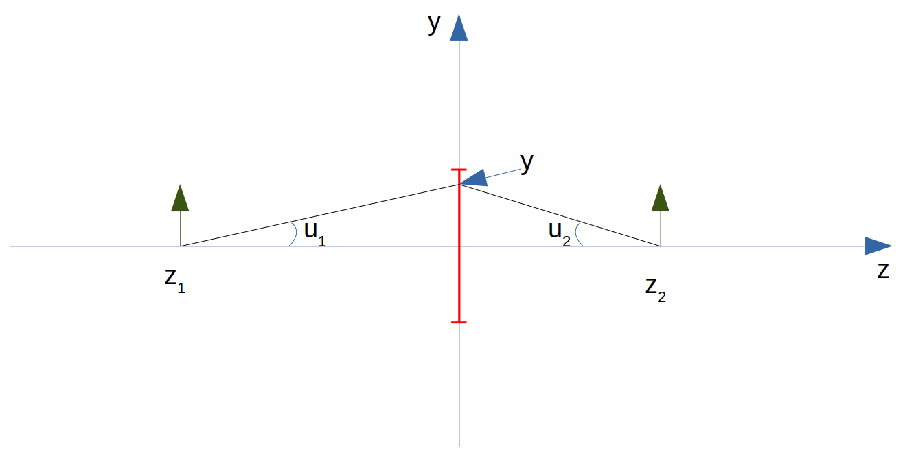
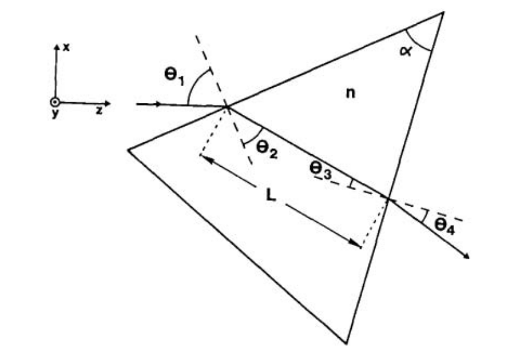

.. _ABCD description:

ABCD description
=======================

`PAOS` implements the paraxial theory described in
`Lawrence et al., Applied Optics and Optical Engineering, Volume XI (1992) <https://ui.adsabs.harvard.edu/abs/1992aooe...11..125L>`_.

In `PAOS`, this is handled by the class :class:`~paos.paos_abcd.ABCD`.

.. _Paraxial region:

Paraxial region
-----------------------

For self-consistency, we give a definition for paraxial region, following
`Smith, Modern Optical Engineering, Third Edition (2000) <https://spie.org/Publications/Book/387098>`_.

The paraxial region of an optical system is a thin threadlike region about the optical axis
where all the slope angles and the angles of incidence and refraction may be set equal to their
sines and tangents.

Optical coordinates
-----------------------

The `PAOS` code implementation assumes optical coordinates as defined in :numref:`coordinates_def`.

.. _coordinates_def:

   `Optical coordinates definition`

where

#. :math:`z_{1}` is the coordinate of the object (:math:`<0` in the diagram)
#. :math:`z_{2}` is the coordinate of the image (:math:`>0` in the diagram)
#. :math:`u_{1}` is the slope, i.e. the tangent of the angle = angle in paraxial approximation; :math:`u_{1} > 0` in the diagram.
#. :math:`u_{2}` is the slope, i.e. the tangent of the angle = angle in paraxial approximation; :math:`u_{2} < 0` in the diagram.
#. y is the coordinate where the rays intersect the thin lens (coloured in red in the diagram).

The (thin) lens equation is

.. math::
    -\frac{1}{z_1}+\frac{1}{z_2} = \frac{1}{f}
    :label:

where :math:`f` is the lens focal length: :math:`f > 0` causes the beam to be more convergent,
while :math:`f < 0` causes the beam to be more divergent.

The tangential plane is the YZ plane and the sagittal plane is the XZ plane.

Ray tracing
----------------------------

Paraxial ray tracing in the tangential plane (YZ) can be done by defining the vector :math:`\vec{v_{t}}=(y, u_{y})`
which describes a ray propagating in the tangential plane.
Paraxial ray tracing can be done using ABCD matrices (see later in :ref:`Optical system equivalent`).

.. note::
    In the sagittal plane, the same equation apply, modified when necessary when cylindrical symmetry is violated.
    The relevant vector is :math:`\vec{v_{s}}=(x, u_{x})`.

`PAOS` implements the function :func:`~paos.paos_raytrace.raytrace` to perform a diagnostic ray tracing of an optical
system, given the input fields and the optical chain. This function then prints the ray positions and slopes in the
tangential and sagittal planes for each surface of the optical chain.

Example
^^^^^^^^^^

Code snippet to call :func:`~paos.paos_raytrace.raytrace`, provided you already have the optical chain (if not,
back to :ref:`Parse configuration file`).

.. code-block:: python

        from paos.paos_raytrace import raytrace
        raytrace(field={'us': 0.0, 'ut': 0.0}, opt_chain=optical_chain)

Propagation
----------------------------

Either in free space or in a refractive medium, propagation over a distance :math:`t` (positive left
:math:`\rightarrow` right) is given by

.. math::
    \begin{pmatrix}
    y_2\\
    u_2
    \end{pmatrix} =
    \begin{pmatrix}
    1 & t\\
    0 & 1
    \end{pmatrix}
    \begin{pmatrix}
    y_1\\
    u_1
    \end{pmatrix} =
    \hat{T}
    \begin{pmatrix}
    y_1 \\
    u_1
    \end{pmatrix}
    :label:

Example
^^^^^^^^^^

Code snippet to use :class:`~paos.paos_abcd.ABCD` to propagate a light ray over a thickness
:math:`t = 50.0 \ \textrm{mm}`.

.. code-block:: python

        from paos.paos_abcd import ABCD
        thickness = 50.0  # mm
        abcd = ABCD(thickness=thickness)
        (A, B), (C, D) = abcd.ABCD

Thin lenses
----------------------------

A thin lens changes the slope angle and this is given by

.. math::
    \begin{pmatrix}
    y_2\\
    u_2
    \end{pmatrix} =
    \begin{pmatrix}
    1 & 0\\
    -\Phi & 1
    \end{pmatrix}
    \begin{pmatrix}
    y_1\\
    u_1
    \end{pmatrix} =
    \hat{L}
    \begin{pmatrix}
    y_1 \\
    u_1
    \end{pmatrix}
    :label:

where :math:`\Phi = \frac{1}{f}` is the lens optical power.

Example
^^^^^^^^^^

Code snippet to use :class:`~paos.paos_abcd.ABCD` to simulate the effect of a thin lens with radius of
curvature :math:`R = 20.0 \ \textrm{mm}` on a light ray.

.. code-block:: python

        from paos.paos_abcd import ABCD
        radius = 20.0  # mm
        abcd = ABCD(curvature=1.0/radius)
        (A, B), (C, D) = abcd.ABCD

Dioptre
----------------------------

When light propagating from a medium with refractive index :math:`n_1` enters in a dioptre of refractive index
:math:`n_2`, the slope varies as

.. math::
    \begin{pmatrix}
    y_2\\
    u_2
    \end{pmatrix} =
    \begin{pmatrix}
    1 & 0\\
    -\frac{\Phi}{n_2} & \frac{n_1}{n_2}
    \end{pmatrix}
    \begin{pmatrix}
    y_1\\
    u_1
    \end{pmatrix} =
    \hat{D}
    \begin{pmatrix}
    y_1 \\
    u_1
    \end{pmatrix}
    :label:

with the dioptre power :math:`\Phi = \frac{n_2-n_1}{R}`, where :math:`R` is the dioptre radius of curvature.

.. note::
    :math:`R>0` if the centre of curvature is at the right of the dioptre and :math:`R<0` if at the left.

Example
^^^^^^^^^^

Code snippet to use :class:`~paos.paos_abcd.ABCD` to simulate the effect of a dioptre with radius of curvature
:math:`R = 20.0 \ \textrm{mm}` that causes a change of medium from :math:`n_1 = 1.0` to :math:`n_2 = 1.5` on a light ray.

.. code-block:: python

        from paos.paos_abcd import ABCD
        n1, n2 = 1.0, 1.5
        radius = 20.0  # mm
        abcd = ABCD(curvature = 1.0/radius, n1 = n1, n2 = n2)
        (A, B), (C, D) = abcd.ABCD

Medium change
----------------------------

The limiting case of a dioptre with :math:`R \rightarrow \infty` represents a change of medium.

.. math::
    \begin{pmatrix}
    y_2\\
    u_2
    \end{pmatrix} =
    \begin{pmatrix}
    1 & 0\\
    0 & \frac{n_1}{n_2}
    \end{pmatrix}
    \begin{pmatrix}
    y_1\\
    u_1
    \end{pmatrix} =
    \hat{N}
    \begin{pmatrix}
    y_1 \\
    u_1
    \end{pmatrix}
    :label:

Example
^^^^^^^^^^

Code snippet to use :class:`~paos.paos_abcd.ABCD` to simulate the effect of a change of medium from
:math:`n_1 = 1.0` to :math:`n_2 = 1.5` on a light ray.

.. code-block:: python

        from paos.paos_abcd import ABCD
        n1, n2 = 1.0, 1.5
        abcd = ABCD(n1 = n1, n2 = n2)
        (A, B), (C, D) = abcd.ABCD

Thick lenses
----------------------------

A real (thick) lens is modelled as

.. math::
    \begin{pmatrix}
    y_2\\
    u_2
    \end{pmatrix} =
    \hat{D_b}\hat{T}\hat{D_a}
    \begin{pmatrix}
    y_1 \\
    u_1
    \end{pmatrix}
    :label:

i.e. propagation through the dioptre :math:`D_a` (first encountered by the ray), then a propagation in the medium,
followed by the exit dioptre :math:`D_b`.

.. note::
    When the thickness of the dioptre, :math:`t`, is negligible and can be set to zero, this gives back the
    thin lens ABCD matrix.

.. note::
    If a dioptre has :math:`R \rightarrow \infty`, this gives a plano-concave or plano-convex lens, depending
    on the curvature of the other dioptre.

Example
^^^^^^^^^^

Code snippet to use :class:`~paos.paos_abcd.ABCD` to simulate the effect of a thick lens on a light ray. The
lens is :math:`t_c = 5.0 \ \textrm{mm}` thick and is plano-convex, i.e. the first dioptre has :math:`R = \infty` and
the second has :math:`R = -20.0 \ \textrm{mm}`, causing the beam to converge. The index of refraction in object space
and in image space is that of free space :math:`n_{os} = n_{is} = 1.0`, while the lens medium has :math:`n_l = 1.5`.

.. code-block:: python

        import numpy as np
        from paos.paos_abcd import ABCD

        radius1, radius2 = np.inf, -20.0  # mm
        n_os, n_l, n_is = 1.0, 1.5, 1.0
        center_thickness = 5.0
        abcd = ABCD(curvature = 1.0/radius1, n1 = n_os, n2 = n_l)
        abcd = ABCD(thickness = center_thickness) * abcd
        abcd = ABCD(curvature = 1.0/radius2, n1 = n_l, n2 = n_is) * abcd
        (A, B), (C, D) = abcd.ABCD

.. _Magnification:

Magnification
----------------------------

A magnification is modelled as

.. math::
    \begin{pmatrix}
    y_2\\
    u_2
    \end{pmatrix} =
    \begin{pmatrix}
    M & 0\\
    0 & 1/M
    \end{pmatrix} =
    \hat{M}
    \begin{pmatrix}
    y_1 \\
    u_1
    \end{pmatrix}
    :label:

Example
^^^^^^^^^^

Code snippet to use :class:`~paos.paos_abcd.ABCD` to simulate the effect of a magnification :math:`M = 2.0`
on a light ray.

.. code-block:: python

        from paos.paos_abcd import ABCD
        from paos.paos_abcd import ABCD
        abcd = ABCD(M=2.0)
        (A, B), (C, D) = abcd.ABCD

Prism
----------------------------

The prism changes both the slope and the magnification. Following
`J. Taché, "Ray matrices for tilted interfaces in laser resonators," Appl. Opt. 26, 427-429 (1987) <https://www.osapublishing.org/viewmedia.cfm?r=1&rwjcode=ao&uri=ao-26-3-427&html=true>`_
we report the ABCD matrices for the tangential and sagittal transfer:

.. math::
    P_{t} =
    \begin{pmatrix}
    \frac{cos(\theta_{4})}{cos(\theta_{3})} & 0\\
    0 & \frac{n cos(\theta_{3})}{cos(\theta_{4})}
    \end{pmatrix}
    \begin{pmatrix}
    1 & L\\
    0 & 1
    \end{pmatrix}
    \begin{pmatrix}
    \frac{cos(\theta_{2})}{cos(\theta_{1})} & 0\\
    0 & \frac{cos(\theta_{1})}{n cos(\theta_{2})}
    \end{pmatrix}
    :label:

.. math::
    P_{s} =
    \begin{pmatrix}
    1 & \frac{L}{n}\\
    0 & 1
    \end{pmatrix}
    :label:

where n is the refractive index of the prism, L is the geometrical path length of the prism, and the
angles :math:`\theta_i` are as described in Fig.2 from the article, reported in :numref:`prismtache`.

.. _prismtache:

   `Ray propagation through a prism`

After some algebra, the ABCD matrix for the tangential transfer can be rewritten as:

.. math::
    P_{t} =
    \begin{pmatrix}
    A & B\\
    C & D
    \end{pmatrix}
    :label:

where

.. math::
      A = \frac{cos(\theta_2) cos(\theta_4)}{cos(\theta_1) cos(\theta_3)} \\
      B = \frac{L}{n} \frac{cos(\theta_1) cos(\theta_4)}{cos(\theta_2) cos(\theta_3)} \\
      C = 0.0 \\
      D = 1.0/A
    :label:

Example
^^^^^^^^^^

Code snippet to use :class:`~paos.paos_abcd.ABCD` to simulate the effect of a prism on a collimated light ray.
The prism is :math:`t = 8.0 \ \textrm{mm}` thick and has a refractive index of :math:`n_p = 1.5`. The prism angles
:math:`\theta_i` are selected in conformity with the ray propagation in :numref:`prismtache`.

.. code-block:: python

        import numpy as np
        from paos.paos_abcd import ABCD

        thickness = 8.0e-3  # m
        n = 1.5

        theta_1 = np.deg2rad(60.0)
        theta_2 = np.deg2rad(-30.0)
        theta_3 = np.deg2rad(20.0)
        theta_4 = np.deg2rad(-30.0)

        A = np.cos(theta_2)*np.cos(theta_4)/(np.cos(theta_1)*np.cos(theta_3))
        B = np.cos(theta_1)*np.cos(theta_4)/(np.cos(theta_2)*np.cos(theta_3))/n
        C = 0.0
        D = 1.0/A

        abcdt = ABCD()
        abcdt.ABCD = np.array([[A,B], [C,D]])
        abcds = ABCD()
        abcds.ABCD= np.array([[1, thickness/n], [0, 1]])

.. _Optical system equivalent:

Optical system equivalent
----------------------------

The ABCD matrix method is a convenient way of treating an arbitrary optical system in the paraxial approximation.
This method is used to describe the paraxial behavior, as well as the Gaussian beam properties and the general
diffraction behaviour.

Any optical system can be considered a black box described by an effective ABCD matrix.
This black box and its matrix can be decomposed into four, non-commuting elementary operations (primitives):

#. magnification change
#. change of refractive index
#. thin lens
#. translation of distance (thickness)

Explicitly:

.. math::
    \begin{pmatrix}
    A & B\\
    C & D
    \end{pmatrix} =
    \begin{pmatrix}
    1 & t\\
    0 & 1
    \end{pmatrix}
    \begin{pmatrix}
    1 & 0\\
    -\Phi & 1
    \end{pmatrix}
    \begin{pmatrix}
    1 & 0\\
    0 & n_1/n_2
    \end{pmatrix}
    \begin{pmatrix}
    M & 0\\
    0 & 1/M
    \end{pmatrix} =
    \hat{T}\hat{L}\hat{N}\hat{M}
    :label:

where the four free parameters :math:`t`, :math:`\Phi`, :math:`n_1/n_2`, :math:`M` are, respectively, the effective
thickness, power, refractive index ratio, and magnification. Not to be confused with thickness, power, refractive
index ratio, and magnification of the optical system under study and its components.

All diffraction propagation effects occur in the single propagation step of distance :math:`t`.
Only this step requires any substantial computation time.

The parameters are estimated as follows:

.. math::
      M = \frac{A D - B C}{D} \\
      n_1/n_2 = M D \\
      t = \frac{B}{D} \\
      \Phi = - \frac{C}{M}
    :label:

With these definitions, the effective focal length is

.. math::
    f_{eff} = \frac{1}{\Phi M}
    :label:

Example
^^^^^^^^^^

Code snippet to use :class:`~paos.paos_abcd.ABCD` to simulate an optical system equivalent for a
magnification :math:`M = 2.0`, a change of medium from :math:`n_1 = 1.0` to :math:`n_2 = 1.5`,
a thin lens with radius of curvature :math:`R = 20.0 \ \textrm{mm}`, and a propagation over a thickness
:math:`t = 5.0 \ \textrm{mm}`.

.. code-block:: python

        from paos.paos_abcd import ABCD

        radius = 20.0  # mm
        n1, n2 = 1.0, 1.5
        thickness = 5.0  # mm
        magnification = 2.0

        abcd = ABCD(thickness = thickness, curvature = 1.0/radius, n1 = n1, n2 = n2, M = magnification)
        (A, B), (C, D) = abcd.ABCD

