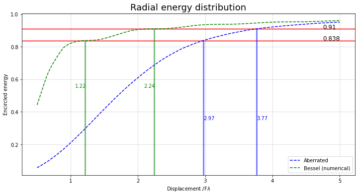
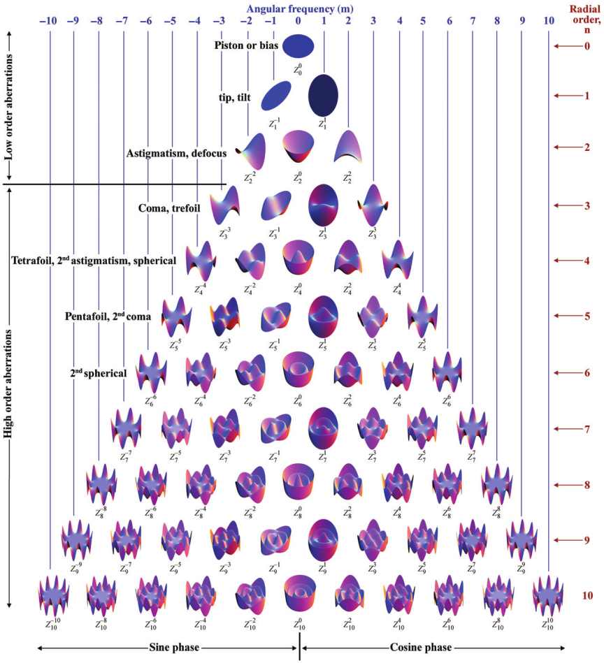
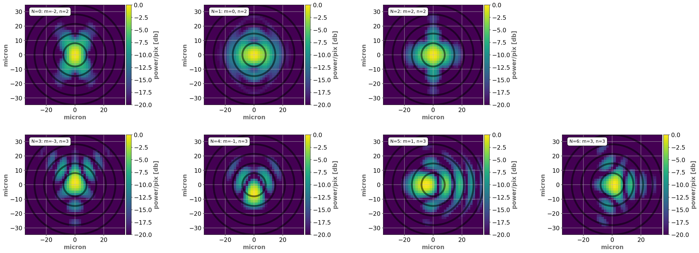

.. _Aberration description:

Aberration description
=======================

Brief description of wavefront error (WFE) modelling and how it is implemented in `PAOS`.

In `PAOS`, this is handled by the class :class:`~paos.classes.zernike.Zernike`.

Introduction
--------------

In optics, aberration is a property of optical systems, that causes light to be spread out
over some region of space rather than focused to a point. An aberration causes an image-forming optical system
to depart from the prediction of paraxial optics (see :ref:`Paraxial region`), producing an image which is not sharp.
The WFE and the resulting image distortion depend on the type of aberration.

The WFE can be modelled as a superposition of Zernike polynomials that describe :ref:`Optical aberrations`
and a random Gaussian field that describes :ref:`Surface roughness`. That is, the WFE can be decomposed into low
frequency and medium-to-high frequency contributors.

Useful concepts to estimate image quality such as

#. :ref:`Strehl ratio`
#. :ref:`Encircled energy`

are discussed in the following sections for reference, although they are not implemented in the main `PAOS` code.

.. _Strehl ratio:

Strehl ratio
^^^^^^^^^^^^^^^^^^^^^^^^^^^^^^^^^^^^

For large aberrations, the image size is larger than the Airy disk. From the conservation of energy,
the irradiance at the center of the image has to decrease when the image size increases.

A useful definition for image quality is the Strehl ratio (see e.g.
`Malacara-Hernández, Daniel & Malacaea-Hernandez, Zacarias & Malacara, Zacarias. (2005). Handbook of Optical Design Second Edition. <https://www.researchgate.net/publication/233842500_Handbook_of_Optical_Design_Second_Edition/citations>`_),
i.e. the ratio of the irradiance at the center of the aberrated PSF to that of an ideal Airy function, which is
approximated as

.. math::
    \textrm{Strehl ratio} \simeq 1 - k^2 \sigma_{W}^{2}
    :label:

where :math:`k` is the wavenumber and :math:`\sigma_{W}` is the wavefront variance, i.e. the square of the
rms wavefront deviation. This expression is adequate to estimate the image quality for Strehl ratios as low as
:math:`0.5`.

.. _Encircled energy:

Encircled energy
^^^^^^^^^^^^^^^^^^^^^^^^^^^^^^^^^^^^

Another useful way to estimate how much an optical system deviates from optimal is to compute the radial (or encircled)
energy distribution of the PSF.

The encircled energy can be obtained from the spot diagram by counting the number of points in the
diagram, inside of circles with different diameters. Alternatively, the fraction of the encircled energy :math:`f` in
function of the encircled energy aperture radius :math:`R_f` in image-space-normalized units can be computed as

.. math::
    f = \int_{0}^{2\pi} \int_{0}^{R_f} PSF(r, \phi) \ r \ d r \ d\phi
    :label:

For an ideal diffraction limited system :math:`R_{0.838} = 1.22`, and :math:`R_{0.910} = 2.26` are the energy encircled
in the first and second Airy null, respectively. For an optical system that can be described using a single :math:`F_\#`
the normalised radii can be expressed in units of wavelengths using

.. math::
    r = R_f F_{\#} \lambda
    :label:

:numref:`radialenergy` reports the encircled energy in function of :math:`R_f` for an aberrated PSF and a
diffraction limited PSF. The :math:`83.8\%` and :math:`91.0\%` levels are marked in red for the aberrated PSF,
and in black for the diffraction limited PSF.

.. _radialenergy:

   `Encircled energy`

.. _Optical aberrations:

Optical aberrations
---------------------

`PAOS` models an optical aberration using a series of Zernike polynomials, up to a specified radial order.

Following `Laksminarayan & Fleck, Journal of Modern Optics (2011) <https://doi.org/10.1080/09500340.2011.633763>`_, the function
describing an arbitrary wavefront wavefront in polar coordinates W(:math:`r, \theta`) can be expanded in terms
of a sequence of Zernike polynomials as

.. math::
    W(\rho, \theta) = \sum_{n, m} C_{n}^{m} Z_{n}^{m} (\rho, \theta)
    :label: Zernike_series

where :math:`C_{n}^{m}` are the coefficient of the Zernike polynomial :math:`Z_{n}^{m} (\rho, \theta)`.

The first three terms in :eq:`Zernike_series` describe Piston and Tilt aberrations and can be neglected.
Non-normalised Zernike polynomials are defined in `PAOS` as:

.. _Zernike_pol:

.. math::
    Z_{n}^{m} =
    \begin{cases}
    R_{n}^{m}(\rho) \ cos(m \phi) \  \hspace{4cm} m \geq 0   \\
    R_{n}^{-m}(\rho) \ cos(m \phi)   \hspace{3.8cm} m < 0      \\
    0                                \hspace{6.55cm} n - m \ \textrm{is odd} \\
    \end{cases}
    :label:

where the radial polynomial is normalized such that :math:`R_{n}^{m}(\rho = 1) = 1`, or

.. math::
    \left< \left[Z_{n}^{m} (\rho, \phi)\right]^{2} \right> = 2\frac{n + 1}{1 + \delta_{m0}}
    :label: Zernike_rms_norm

with :math:`\delta_{mn}` the Kroneker delta function, and the average operator :math:`\left<\right>` is intended
over the pupil.

Using polar elliptical coordinates allows `PAOS` to describe pupils that are elliptical in shape as well as circular:

.. math::
    \rho^{2} = \frac{x_{pup}^{2}}{a^{2}} + \frac{y_{pup}^{2}}{b^{2}}
    :label:

where :math:`x_{pup}` and :math:`y_{pup}` are the pupil physical coordinates and :math:`a` and :math:`b` are the pupil
semi-major and semi-minor axes, respectively.

:numref:`zpol` reports surface plots of the Zernike polynomial sequence up to radial order :math:`n=10`. The name of the classical
aberration associated with some of them is also provided (figure taken from `Laksminarayan & Fleck, Journal of Modern Optics (2011) <https://doi.org/10.1080/09500340.2011.633763>`_).

.. _zpol:

   `Zernike polynomials surface plots`

`PAOS` can generate both ortho-normal polynomials and orthogonal polynomials and the ordering can be either ANSI
(default), or Noll, or Fringe, or Standard (see e.g. `Born and Wolf, Principles of Optics, (1999) <https://doi.org/10.1017/CBO9781139644181>`_).

Example of an aberrated pupil
^^^^^^^^^^^^^^^^^^^^^^^^^^^^^^^^^^^^

An example of aberrated PSFs at the `Ariel` Telescope exit pupil is shown in :numref:`aberrations`.

.. _aberrations:

   `Ariel Telescope exit pupil PSFs for different aberrations and same SFE`

In this figure, the same Surface Form Error (SFE) of :math:`50 \ \textrm{nm}` root mean square (rms)
is allocated to different optical aberrations. Starting from the top left panel (oblique Astigmatism),
seven such simulations are shown, in ascending Ansi order.

Each aberration has a different impact on optical quality, requiring a detailed analysis to translate e.g. a
scientific requirement on optical quality into a WFE allocation.

.. _Surface roughness:

Surface roughness
-------------------

Optical elements exhibit surface roughness, i.e. medium to high frequency defects produced during manufacturing
(e.g. using diamond turning machines). The resulting aberrations can be described as a zero-mean random Gaussian
field with variance :math:`\sigma_{G}`.

Surface roughness is not yet developed in the main `PAOS` code.
