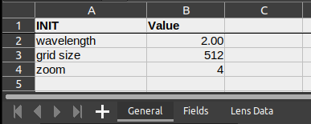
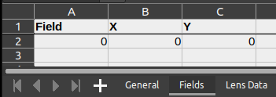
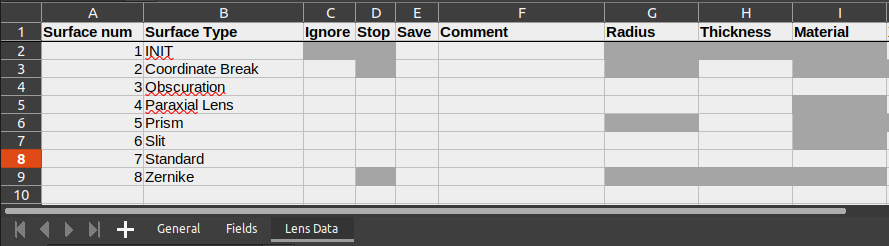
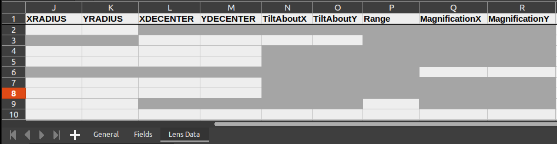

.. _Input system:

Input system
=======================

`PAOS` has a generic input system that tries to mimic the Zemax OpticStudio :math:`^{©}`
interface to allow the user expert in Computer Aided Design (CAD) modeling to simulate also optical systems
other than `Ariel`.

For instance, `PAOS` is currently used to simulate the optical performance of the stratospheric balloon-borne
experiment EXCITE
(`Tucker et al., The Exoplanet Climate Infrared TElescope (EXCITE) (2018) <https://doi.org/10.1117/12.2314225>`_).

.. tip::
    The interested reader may refer to the section :ref:`Plotting results` to see an example of `PAOS` results for EXCITE.

Having a generic input system was also advantageous to validate the `PAOS` code, allowing to use the Hubble
optical system (see :ref:`Validation`).

Configuration file
----------------------

The configuration file is an Excel spreadsheet containing three data sheets named `General`, `Fields` and `Lens Data`.

`General` (see :numref:`general`) has the simulation wavelength in micron, grid size in pixel and zoom, defined as the ratio of grid size to initial
beam size in unit of pixel.

.. _general:

   `General`

`Fields` (see :numref:`fields`) has the input field angles in degrees.

.. _fields:

   `Fields`

`Lens Data` (see :numref:`lensdata1` and :numref:`lensdata2`) is the lens data and contains the sequence of surfaces for the simulation.
Supported surface types include Coordinate Break, Standard, Obscuration, Paraxial Lens, Prism, Slit and Zernike.

Setting the `Ignore` flag to 1 skips the current surface, while setting the `Stop` flag to 1 makes the current surface
a Stop (see :ref:`Stops`). To save the current surface, set the `Save` flag to 1.

Depending on the surface, optical materials are supported (see :ref:`Materials description`).

.. _lensdata1:

   `Lens Data (1)`

.. _lensdata2:

   `Lens Data (2)`

Read configuration file
^^^^^^^^^^^^^^^^^^^^^^^^^^^

Given the input file name, `PAOS` implements :func:`~paos.paos_parseconfig.ReadConfig`, a function that opens the file
and returns the simulation parameters, as shown in the example below.

Example
~~~~~~~~~~~
Code snippet to read a `PAOS` configuration file.

.. code-block:: python

        from paos.paos_parseconfig import ReadConfig
        simulation_parameters = ReadConfig('path/to/conf/file')

.. _Parse configuration file:

Parse configuration file
^^^^^^^^^^^^^^^^^^^^^^^^^^^^^

Then, the simulation parameters are parsed by :func:`~paos.paos_parseconfig.ParseConfig` that prepares the simulation run.
This function then returns the input pupil diameter along with the general parameters, the input fields
and the optical chain, as shown the example below.

Example
~~~~~~~~~~~
Code snippet to parse a `PAOS` configuration file.

.. code-block:: python

        from paos.paos_parseconfig import ParseConfig
        pupil_diameter, general, fields, optical_chain = ParseConfig('path/to/conf/file')
