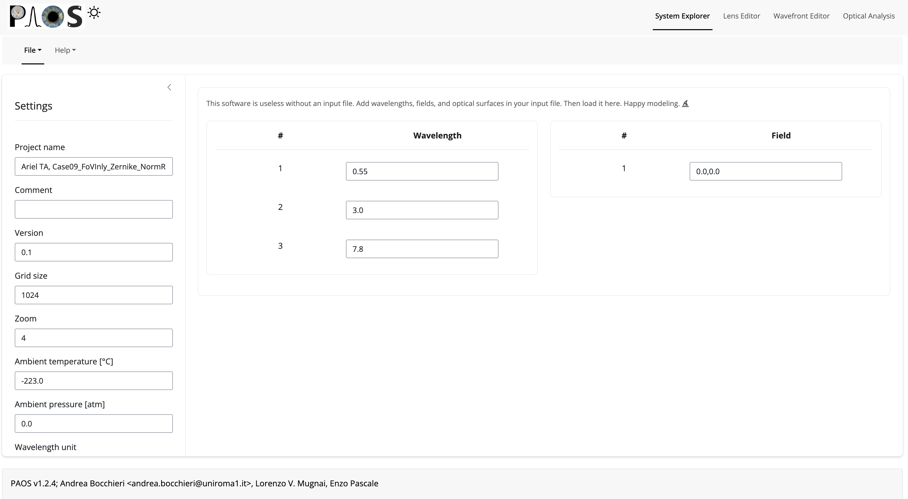
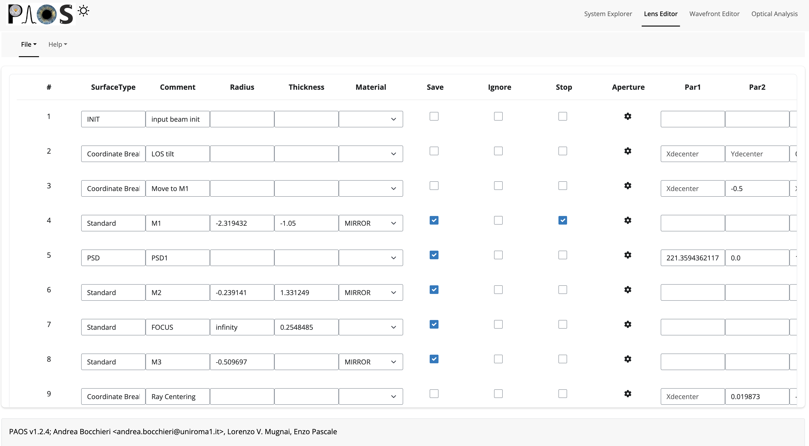
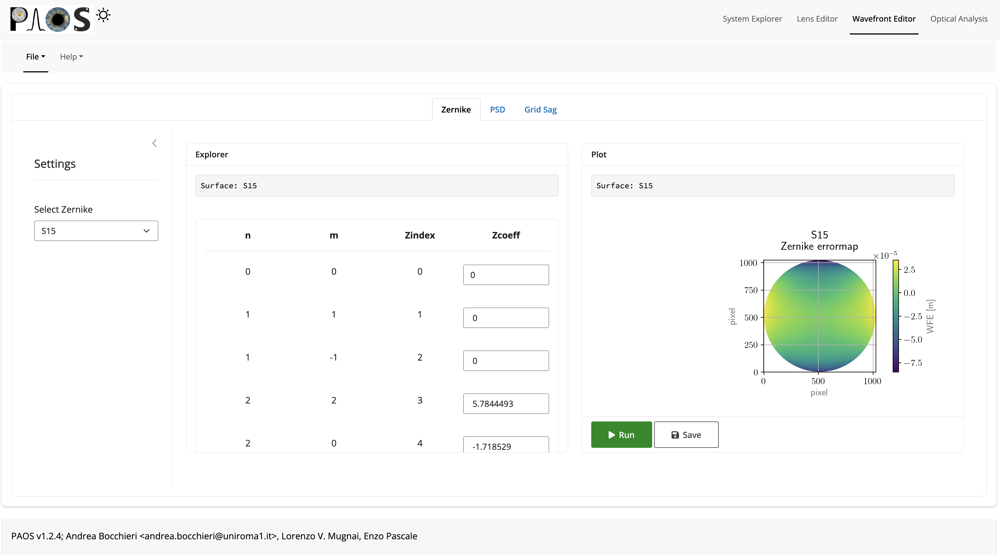
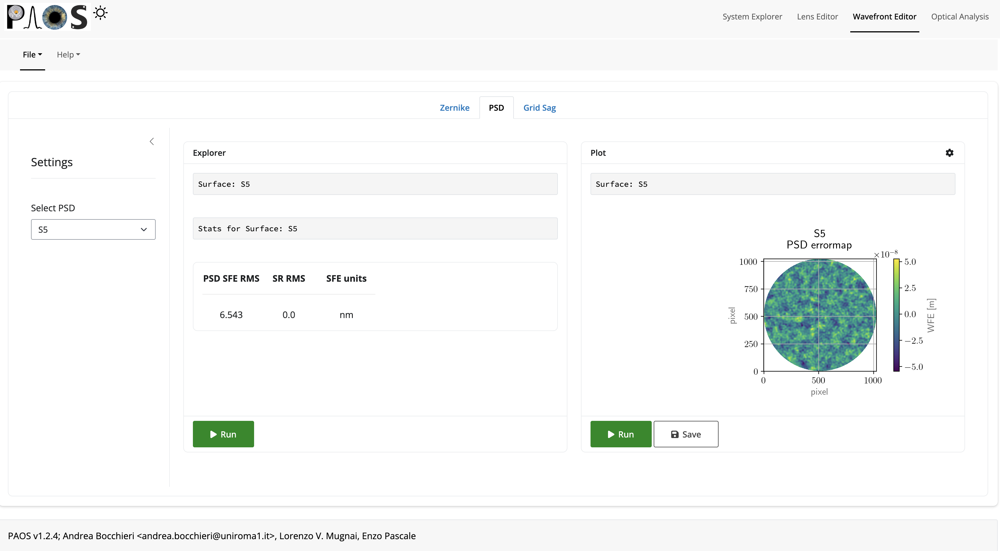
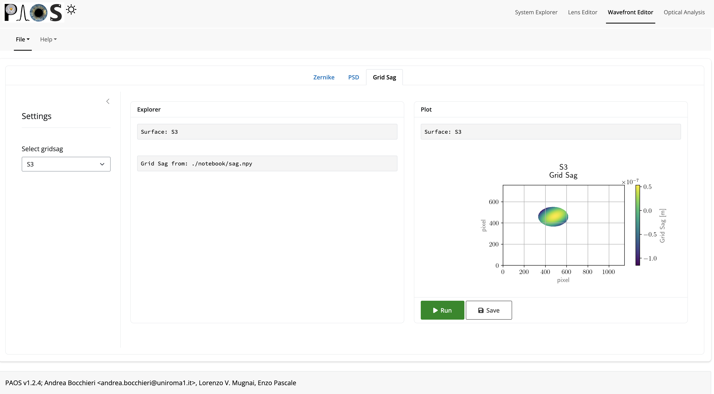
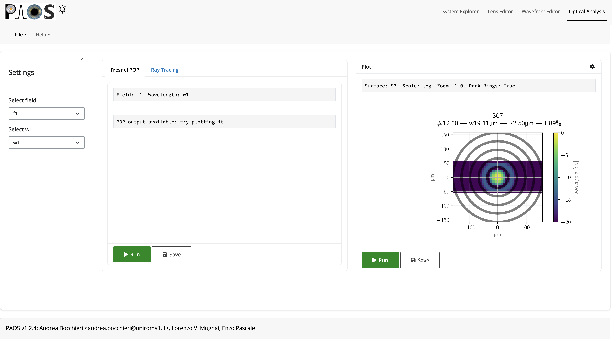

.. _Input system:

Input system
=======================

``PAOS`` has a generic input system to be used by anyone expert in Computer Aided Design (CAD).

Its two pillars are

#. The :ref:`Configuration file`
    A .ini configuration file with structure similar to that of Zemax OpticStudio :math:`^{©}`;
#. The :ref:`GUI editor`
    A GUI to dynamically modify the configuration file and launch instant POP simulations.

This structure allows the user to write configuration files from scratch or edit existing ones in a dynamic way, and to launch automatized POP simulations that reflect the edits without requiring advanced programming skills.

From a broad perspective, this input system has two advantages:

#. It can be used to design and test any optical system with relative ease.
    Outside Ariel, ``PAOS`` is currently used to simulate the optical performance of the stratospheric balloon-borne experiment `EXCITE <https://doi.org/10.1117/12.2314225>`_.

    .. tip::
        The interested reader may refer to the section :ref:`Plot` to see an example of ``PAOS`` results for
        EXCITE.

#. It helped in validating the ``PAOS`` code against existing simulators.

.. _Configuration file:

Configuration file
----------------------

The configuration file is an .ini file structured into four different sections:

#. DEFAULT
    Optional section, not used

#. :ref:`general section`
#. :ref:`wavelengths section`
#. :ref:`fields section`
#. :ref:`lenses section`

.. note::
    ``PAOS`` defines units as follows:

    #. Lens units: meters
    #. Angles units: degrees
    #. Wavelength units: micron
    #. Temperature units: Celsius
    #. Pressure units: atmospheres

.. _general section:

General
^^^^^^^^^^^
Section describing the general simulation parameters and ``PAOS`` units

.. list-table:: General
   :widths: 40 40 100
   :header-rows: 1

   * - keyword
     - type
     - description

   * - project
     - string
     - A string defining the project name

   * - version
     - string
     - Project version (e.g. 1.0)

   * - grid_size
     - int
     - Grid size for simulation

       Must be in [64, 128, 512, 1024]

   * - zoom
     - int
     - Zoom size

       Must be in [1, 2, 4, 8, 16]

   * - lens_unit
     - string
     - Unit of lenses

       Must be 'm'

   * - tambient
     - float
     - Ambient temperature in Celsius

   * - pambient
     - float
     - Ambient pressure in atmospheres

Below we report a snapshot of this section from the Ariel AIRS CH1 configuration file

.. _general:
.. figure:: general.png
   :align: center

   `General`

.. _wavelengths section:

Wavelengths
^^^^^^^^^^^^^
Section listing the wavelengths to simulate (preferably in increasing order)

.. list-table:: Wavelengths
   :widths: 40 40 100
   :header-rows: 1

   * - keyword
     - type
     - description

   * - w1
     - float
     - First wavelength

   * - w2
     - float
     - Second wavelength

   * - ...
     - ...
     - ...

Below we report a snapshot of this section from the Ariel AIRS CH1 configuration file

.. _wavelengths:
.. figure:: wavelengths.png
   :align: center

   `Wavelengths`

.. _fields section:

Fields
^^^^^^^^^^^^^
Section listing the input fields to simulate

.. list-table:: Fields
   :widths: 40 40 100
   :header-rows: 1

   * - keyword
     - type
     - description

   * - f1
     - float, float
     - Field 1:

       sagittal (x) and tangential (y) angle

   * - f2
     - float, float
     - Field 2:

       sagittal (x) and tangential (y) angle

   * - ...
     - ...
     - ...

Below we report a snapshot of this section from the Ariel AIRS CH1 configuration file

.. _fields:
.. figure:: fields.png
   :align: center

   `Fields`

.. _lenses section:

Lens_xx
^^^^^^^^^^^^^

Lens data sections describing how to define the different optical surfaces (INIT, Coordinate Break,
Standard, Paraxial Lens, ABCD, Zernike, PSD, and Grid Sag) and their required parameters.

.. _lens_xx_table:

.. list-table:: Lens_xx
   :widths: 30 20 20 20 20 20 20 20 20 40
   :header-rows: 1
   :align: center
   :class: longtable

   * - SurfaceType
     - Comment
     - Radius
     - Thickness
     - Material
     - Save
     - Ignore
     - Stop
     - aperture
     - Par1..N

   * - INIT
     - string, e.g. this surface name
     - None
     - None
     - None
     - None
     - None
     - None
     - list
     - None

   * - Coordinate Break
     - ...
     - None
     - float
     - None
     - Bool
     - Bool
     - Bool
     - None
     - None

   * - Standard
     - ...
     - float
     - float
     - MIRROR, others
     - Bool
     - Bool
     - Bool
     - list
     - None

   * - Paraxial Lens
     - ...
     - None
     - float
     - None
     - Bool
     - Bool
     - Bool
     - list
     - Par1 = focal length (float)

   * - ABCD
     - ...
     - None
     - float
     - None
     - Bool
     - Bool
     - Bool
     - list
     - Par1..4 = Ax, Bx, Cx, Dx (sagittal)

       Par5..8 = Ay, By, Cy, Dy (tangential)

   * - Zernike

       In addition to standard parameters defines:

       - Zindex: polynomial index starting from 0

       - Z: coefficients in units of wave

     - ...
     - None
     - None
     - None
     - Bool
     - Bool
     - Bool
     - None
     - Par1 = wavelength (in micron)

       Par2 = ordering, can be standard, ansi, noll, fringe

       Par3 = Normalisation, can be True or False

       Par4 = Radius of support aperture of the polynomial

       Par5 = origin, can be x (counterclockwise positive from x axis) or y (clockwise positive from y axis)

       Par6 = Zorthonorm, False (Zernike circular polynomials) or True (polynomials that are ortho-normal on the mask provided)

       Par7 = Zmask, the pupil on which ortho-normal polynomials are defined. Applies only if Par6 is True. Currently supports only elliptical pupils, following the same convention as when defining an `aperture`. 

   * - PSD
     - ...
     - None
     - None
     - None
     - Bool
     - Bool
     - Bool
     - None
     - Par1 = A

       Par2 = B

       Par3 = C

       Par4 = fknee

       Par5 = fmin

       Par6 = fmax

       Par7 = Surface Roughness

       Par8 = units (usually nm)

   * - Grid Sag
     - ...
     - None
     - None
     - None
     - Bool
     - Bool
     - Bool
     - None
     - Par1 = wavelength (in micron)

       Par2 = Nx (shall be the same as grid_size)

       Par3 = Ny (shall be the same as grid_size)

       Par4 = Dx

       Par5 = Dy

       Par6 = Xdecenter (in pixel)

       Par7 = Ydecenter (in pixel)

       Par8 = Errormap file path

.. note::

    #. Set the `Ignore` flag to 1 to skip the surface
    #. Set the `Stop` flag to 1 to make the surface a Stop (see :ref:`Stops`)
    #. Set the `Save` flat to 1 to later save the output for the surface

.. note::
    The `aperture` keyword is a list with the following format:

    * aperture = shape type, wx, wy, xc, yc
    * shape: either ‘elliptical’ or ‘rectangular’
    * type: either ‘aperture’ or ‘obscuration’
    * wx, wy: semi-axis of elliptical shapes, or full length of rectangular shape sides
    * xc, yc: coordinates of aperture centre

    Example:
    aperture = elliptical aperture, 0.5, 0.3, 0.0, 0.0

.. note::
    The functional form of the PSD is given by:

    :math:`PSD(f) = \frac{A}{B + (f/f_{knee})^C}`

Below we report a snapshot of the first lens data section from the Ariel AIRS CH1 configuration file

.. _lens_xx:
.. figure:: lenses.png
   :align: center

   `Lens_xx`

.. _Parse configuration file:

Parse configuration file
^^^^^^^^^^^^^^^^^^^^^^^^^^^^^

``PAOS`` implements the method :func:`~paos.core.parseConfig.parse_config` that parses the .ini configuration file, prepares the simulation run and returns the simulation parameters and the optical chain. This method can be called as in the example below.

Example
~~~~~~~~~~~
Code example to parse a ``PAOS`` configuration file.

.. code-block:: python

        from paos.core.parseConfig import parse_config
        pup_diameter, parameters, wavelengths, fields, opt_chains = parse_config('path/to/ini/file')

.. _GUI editor:

GUI editor
----------------------

``PAOS`` implements a GUI editor that allows to dynamically edit and modify the configuration file and to launch POP simulations. This makes it effectively the ``PAOS`` front-end. 
To achieve this, ``PAOS`` (v1.2.1 and above) uses the shiny_ package, a Python package that supports the development of Python web applications with the power of reactive programming.

.. note::
  Previous ``PAOS`` versions relied on the PySimpleGui_ package, however this has been discontinued due to a change in their policy.

The quickest way to run the ``PAOS`` GUI is from terminal.

Run it with the `help` flag to read the available options:

.. code-block:: bash

   $ paos_gui --help

.. _GUI command line flags:

.. list-table:: GUI command line flags
   :widths: 60 100
   :header-rows: 1

   * - flag
     - description
   * - ``-h``, ``--help``
     - show this help message and exit
   * - ``-d``, ``--debug``
     - Debug mode screen
   * - ``-l``, ``--logger``
     - Store the log output to file

Where the configuration file shall be an `.ini` file (see :ref:`Configuration file`). 

The GUI editor then opens and displays a window with a standard File Menu (`Open`, `Save`, `Close`) and a Help Menu (`Docs`, `About`). 
The GUI has four Tabs:

#. :ref:`System Explorer`
#. :ref:`Lens Editor`
#. :ref:`Wavefront Editor`
#. :ref:`Optical Analysis`

The user can choose to work in `dark mode` using the switch on the right of the logo.

.. _System Explorer:

System Explorer
^^^^^^^^^^^^^^^^
This Tab opens upon starting the GUI. Its purpose is to setup the main simulation parameters.
It contains a sidebar, which displays the general simulation parameters and ``PAOS`` units, as defined in :ref:`general section`. The contents can be altered as necessary, safe if the the cells are disabled.
On the main tab area the wavelengths and fields are listed, as parsed from the configuration file.

Below we report a snapshot of this Tab.

.. _SystemExplorer:

   `System Explorer`

.. tip::
  You cannot add new wavelengths or fields in the GUI. This needs to happen in the configuration file. So, save your current work to a new .ini config file using `File/Save` and make any changes there. Then, reload the file to the GUI.

.. _Lens Editor:

Lens Editor
^^^^^^^^^^^^^^^^

This Tab contains the list of the optical surfaces describing the optical chain to simulate, as defined in
:ref:`Lens_xx`.

This information is organized as explained in :ref:`lens_xx_table`, with horizontal and vertical scrollbars to allow any movement.

The contents of each cell can be edited as necessary. 

.. tip::
  You cannot add new surfaces or change the surface type in the GUI. This needs to happen in the configuration file. So, save your current work to a new .ini config file using `File/Save` and make any changes there. Then, reload the file to the GUI.

Below we report a snapshot of this Tab.

.. _LensEditor:

   `Lens Editor`

.. tip::
    Placeholders in unused Par1..N parameter cells help remember the cell intended content.

.. tip::
    To see/edit the contents of the `Aperture` column, click on the `gear` icon.

.. _Wavefront Editor:

Wavefront Editor
^^^^^^^^^^^^^^^^^^

This Tab contains three panels, each containing a sidebar as well as an `Explorer` and a `Plot` area. The sidebar allows the user to select the desired surface for modification or plotting.

* ``Zernike``

  The Explorer area contains a Table that lists the Zernike (or ortho-normal) polynomial radial (``n``) and azimuthal (``m``) orders according to the specified Zernike ordering (one of `standard`, `ansi`, `fringe` and `noll`), the index as given by the user (``Zindex``), and the Zernike coefficients (``Z``).
  Only the ``Z`` column is enabled to be modified as required by the user.
  The Plot area allows the user to draw the aberrated surface that corresponds to the Zernike expansion in the table and save it to a file.

Below we report a snapshot of this panel.

.. _ZernikePanel:

   `Zernike Panel`

* ``PSD``

  The Explorer area contains a calculator for the Surface Form Error that corresponds to the PSD parameters (and Surface Roughness), input by the user in the :ref:`Lens Editor`.
  The Plot area allows one to draw the aberrated surface that corresponds to the PSD and save it to a file. The gear icon on the `Plot` header allows one to change the spatial scale for the plot. E.g. the user can draw the PSD on a 1 mm-diameter circle rather than 1-m to better visualize local deformations.

Below we report a snapshot of this panel.

.. _PSDPanel:

   `PSD Panel`

* ``Grid Sag``

  The Explorer area only contains an output text that reports the file path of the errormap input by the user in the :ref:`Lens Editor`.
  The Plot area allows one to draw the aberrated surface that corresponds to the input Grid Sag and save it to a file. 

Below we report a snapshot of this panel.

.. _GridSagPanel:

   `Grid Sag Panel`

.. _Optical Analysis:

Optical Analysis
^^^^^^^^^^^^^^^^

This Tab provides the main GUI functionality: the POP propagation. 
It is updated dinamically based on the parameters input by the user in the :ref:`System Explorer`, :ref:`Lens Editor`, and :ref:`Wavefront Editor` tabs.
The POP simulation is done one wavelength and field at a time, which can be chosen from the dropdown menus in the sidebar.

The main part of the Tab contains three panels:

* ``Fresnel POP``

  Allows to run the wavefront propagation simulation and save the outputs to a binary (.hdf5) file.

* ``Ray Tracing``

  Allows to run user to a diagnostic ray-trace of the optical system, producing an output that is displayed in the text area and can be saved to a text file.

* ``Plot``

  Allows one to draw the squared amplitude of the wavefront. 
  The gear icon on the `Plot` header contains options for selecting a different surface (any surface with ``Save = True`` in the :ref:`lens_xx_table`), changing the plot scale (`linear`  or `log`), zoom factor (the greater, the more zoomed out), and an option to plot dark rings in correspondance to the first 5 zeros of the Airy diffraction pattern. 
  The plot can then be saved to a (.pdf) or (.png) file.

Below we report a snapshot of this Tab.

.. _OpticalAnalysis:

   `Optical Analysis Tab`

.. _shiny: https://shiny.posit.co/py/
.. _PySimpleGui: https://pysimplegui.readthedocs.io/en/latest/