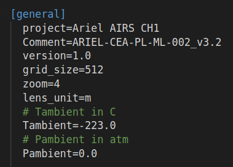
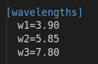
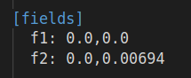
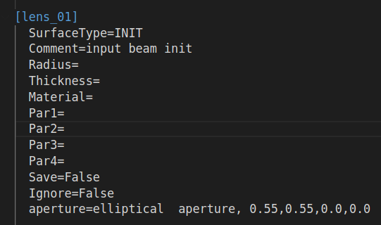
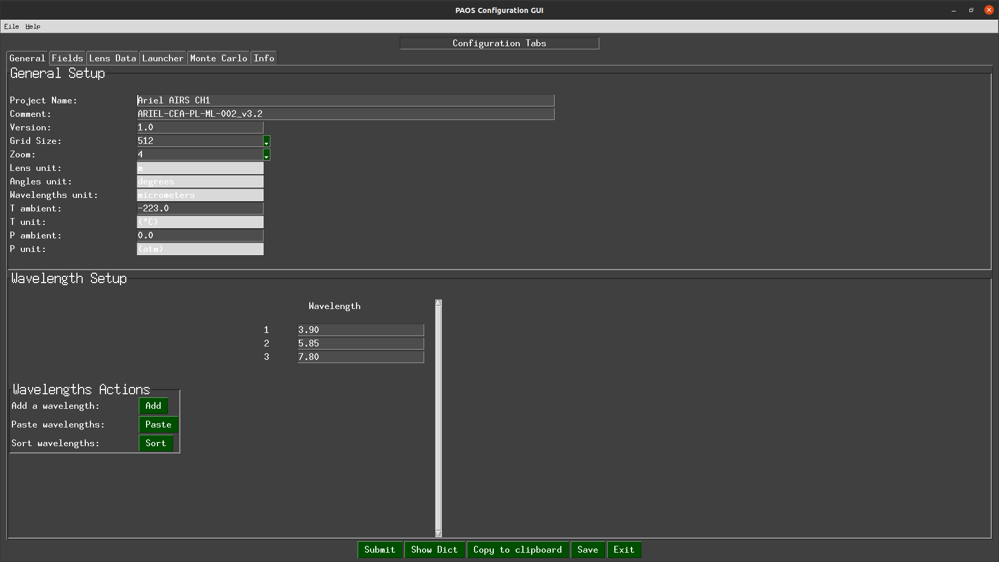
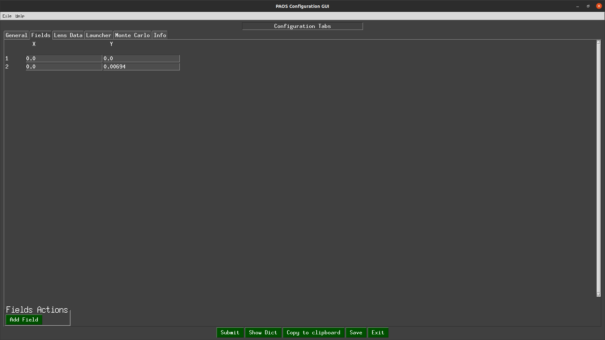
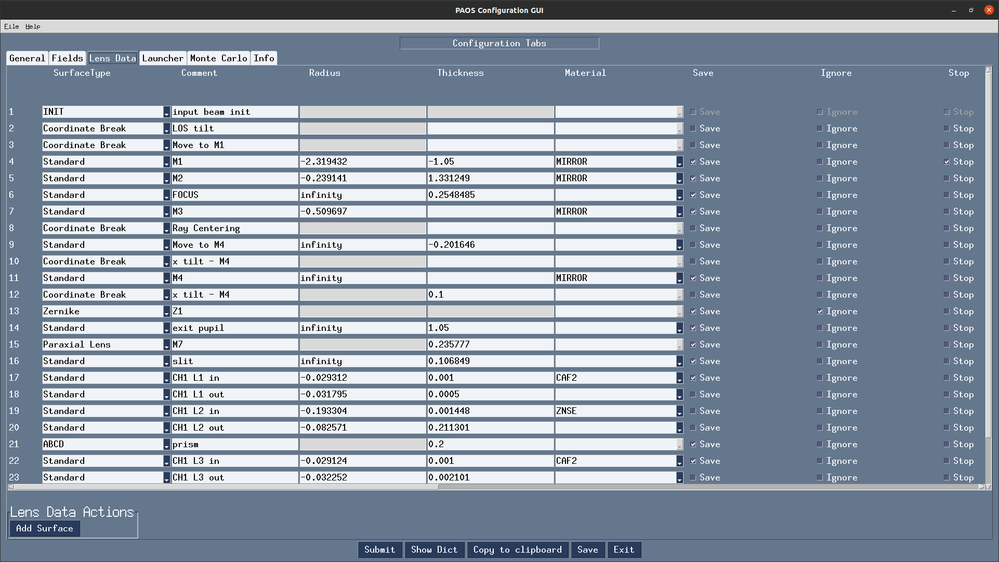
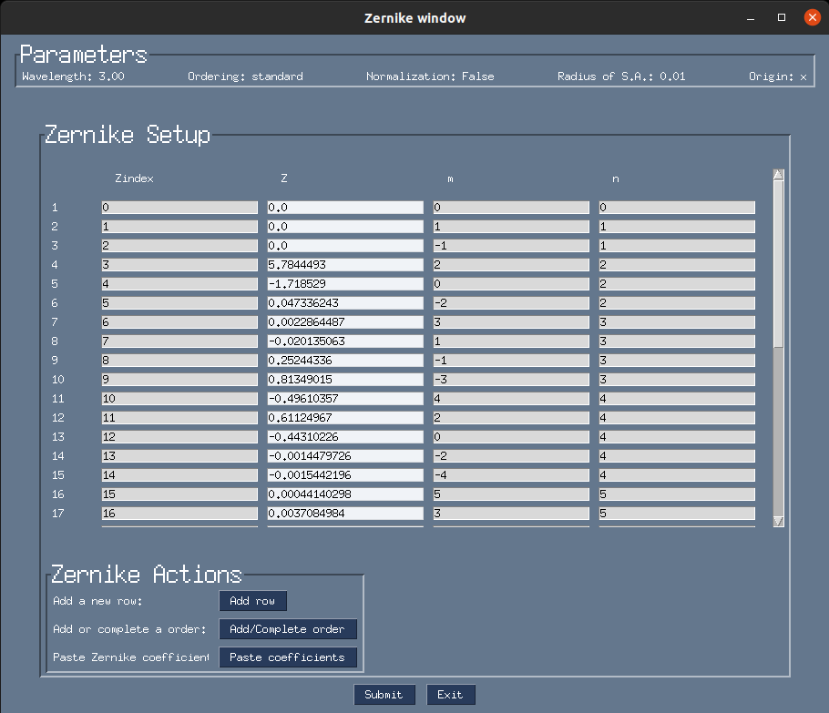
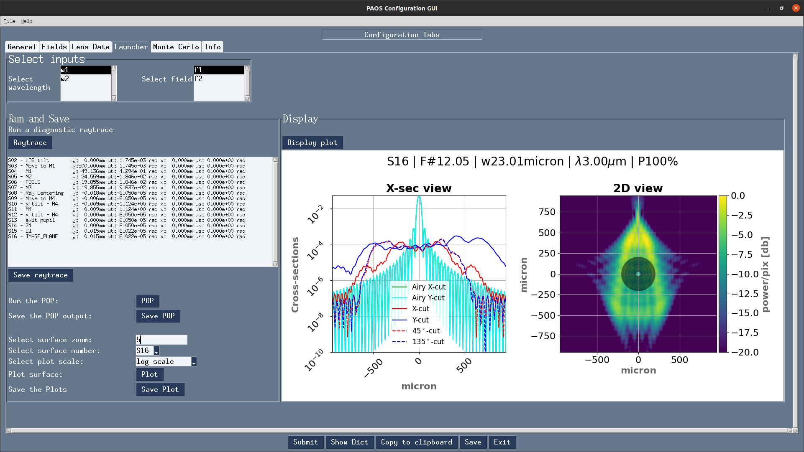
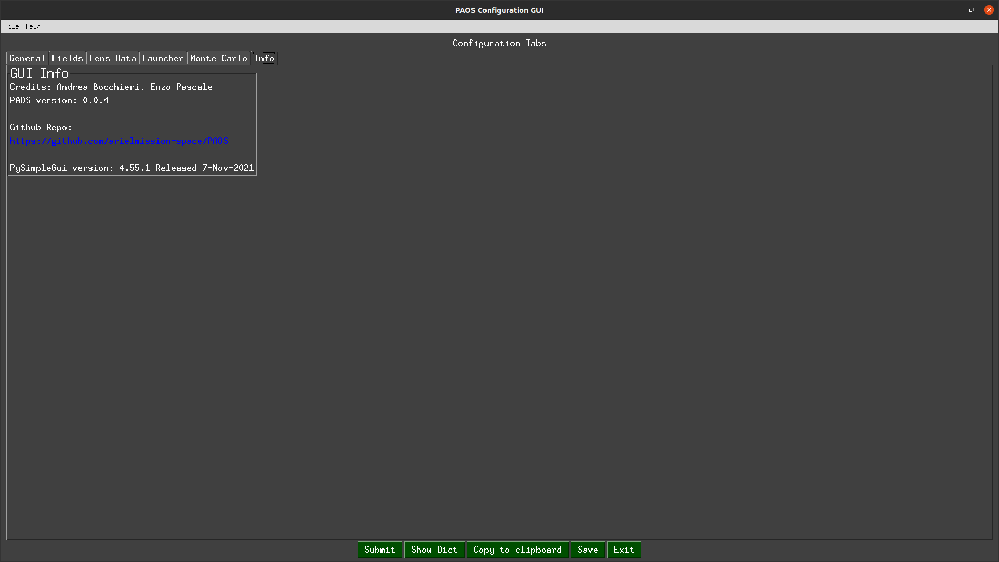

.. _Input system:

Input system
=======================

``PAOS`` has a generic input system to be used by anyone expert in Computer Aided Design (CAD).

Its two pillars are

#. The :ref:`Configuration file`
    A .ini configuration file with structure similar to that of Zemax OpticStudio :math:`^{©}`;
#. The :ref:`GUI editor`
    A GUI to dynamically modify the configuration file and launch instant POP simulations

This structure allows the user to write configuration files from scratch or edit existing ones in a dynamic way, and
to launch automatized POP simulations that reflect the edits without requiring advanced programming skills.

From a broad perspective, this input system has two advantages:

#. It can be used to design and test any optical system with relative ease.
    Outside Ariel, ``PAOS`` is currently used to simulate the optical performance of the stratospheric balloon-borne experiment `EXCITE <https://doi.org/10.1117/12.2314225>`_.

    .. tip::
        The interested reader may refer to the section :ref:`Plotting results` to see an example of ``PAOS`` results for
        EXCITE.

#. It helped in validating the ``PAOS`` code against existing simulators.

.. _Configuration file:

Configuration file
----------------------

The configuration file is an .ini file structured into four different sections:

#. DEFAULT
    Optional section, not used

#. :ref:`general section`
#. :ref:`wavelengths section`
#. :ref:`fields section`
#. :ref:`lenses section`

.. note::
    ``PAOS`` defines units as follows:

    #. Lens units: meters
    #. Angles units: degrees
    #. Wavelength units: micron

.. _general section:

General
^^^^^^^^^^^
Section describing the general simulation parameters and ``PAOS`` units

.. list-table:: General
   :widths: 40 40 100
   :header-rows: 1

   * - keyword
     - type
     - description

   * - project
     - string
     - A string defining the project name

   * - version
     - string
     - Project version (e.g. 1.0)

   * - grid_size
     - int
     - Grid size for simulation

       Must be in [64, 128, 512, 1024]

   * - zoom
     - int
     - Zoom size

       Must be in [1, 2, 4, 8, 16]

   * - lens_unit
     - string
     - Unit of lenses

       Must be 'm'

   * - tambient
     - float
     - Ambient temperature in Celsius

   * - pambient
     - float
     - Ambient pressure in atmospheres

Below we report a snapshot of this section from the Ariel AIRS CH1 configuration file

.. _general:

   `General`

.. _wavelengths section:

Wavelengths
^^^^^^^^^^^^^
Section listing the wavelengths to simulate (preferably in increasing order)

.. list-table:: Wavelengths
   :widths: 40 40 100
   :header-rows: 1

   * - keyword
     - type
     - description

   * - w1
     - float
     - First wavelength

   * - w2
     - float
     - Second wavelength

   * - ...
     - ...
     - ...

Below we report a snapshot of this section from the Ariel AIRS CH1 configuration file

.. _wavelengths:

   `Wavelengths`

.. _fields section:

Fields
^^^^^^^^^^^^^
Section listing the input fields to simulate

.. list-table:: Fields
   :widths: 40 40 100
   :header-rows: 1

   * - keyword
     - type
     - description

   * - f1
     - float, float
     - Field 1:

       sagittal (x) and tangential (y) angle

   * - f2
     - float, float
     - Field 2:

       sagittal (x) and tangential (y) angle

   * - ...
     - ...
     - ...

Below we report a snapshot of this section from the Ariel AIRS CH1 configuration file

.. _fields:

   `Fields`

.. _lenses section:

Lens_xx
^^^^^^^^^^^^^

Lens data sections describing how to define the different optical surfaces (INIT, Coordinate Break,
Standard, Paraxial Lens, ABCD and Zernike) and their required parameters.

.. _lens_xx_table:

.. list-table:: Lens_xx
   :widths: 30 20 20 20 20 20 20 20 20 40
   :header-rows: 1
   :align: center
   :class: longtable

   * - SurfaceType
     - Comment
     - Radius
     - Thickness
     - Material
     - Save
     - Ignore
     - Stop
     - aperture
     - Par1..N

   * - INIT
     - string, this surface name
     - None
     - None
     - None
     - None
     - None
     - None
     - list
     - None

   * - Coordinate Break
     - ...
     - None
     - float
     - None
     - Bool
     - Bool
     - Bool
     - list
     - None

   * - Standard
     - ...
     - float
     - float
     - MIRROR, others
     - Bool
     - Bool
     - Bool
     - list
     - None

   * - Paraxial Lens
     - ...
     - None
     - float
     - None
     - Bool
     - Bool
     - Bool
     - list
     - Par1 = focal length (float)

   * - ABCD
     - ...
     - None
     - float
     - None
     - Bool
     - Bool
     - Bool
     - list
     - Par1..4 = Ax, Bx, Cx, Dx (sagittal)

       Par5..8 = Ay, By, Cy, Dy (tangential)

   * - Zernike

       in addition to standard parameters defines:

       Zindex: polynomial index starting from 0

       Z: coefficients in units of wave

     - ...
     - None
     - None
     - None
     - Bool
     - Bool
     - Bool
     - None
     - Par1 = wavelength (in micron)

       Par2 = ordering, can be standard, ansi, noll, fringe

       Par3 = Normalisation, can be True or False

       Par4 = Radius of support aperture of the polynomial

       Par5 = origin, can be x (counterclockwise positive from x axis) or y (clockwise positive from y axis)

.. note::

    #. Set the `Ignore` flag to 1 to skip the surface
    #. Set the `Stop` flag to 1 to make the surface a Stop (see :ref:`Stops`)
    #. Set the `Save` flat to 1 to later save the output for the surface

.. note::
    The `aperture` keyword is a list with the following format:

    * aperture = shape type, wx, wy, xc, yc
    * shape: either ‘elliptical’ or ‘rectangular’
    * type: either ‘aperture’ or ‘obscuration’
    * wx, wy: semi-axis of elliptical shapes, or full length of rectangular shape sides
    * xc, yc: coordinates of aperture centre

    Example:
    aperture = elliptical aperture, 0.5, 0.3, 0.0, 0.0

Below we report a snapshot of the first lens data section from the Ariel AIRS CH1 configuration file

.. _lens_xx:

   `Lens_xx`

.. _Parse configuration file:

Parse configuration file
^^^^^^^^^^^^^^^^^^^^^^^^^^^^^

``PAOS`` implements the method :func:`~paos.core.parseConfig.parse_config` that parses the .ini configuration file, prepares the
simulation run and returns the simulation parameters and the optical chain. This method can be called as in the example
below.

Example
~~~~~~~~~~~
Code example to parse a ``PAOS`` configuration file.

.. code-block:: python

        from paos.core.parseConfig import parse_config
        pup_diameter, parameters, wavelengths, fields, opt_chains = parse_config('path/to/ini/file')

.. _GUI editor:

GUI editor
----------------------

``PAOS`` implements a GUI editor that allows to dynamically edit and modify the configuration file and to launch POP
simulations. This makes it effectively the ``PAOS`` front-end. To achieve this, ``PAOS`` uses the PySimpleGui_ package,
a Python package that aims at "bridging the GUI gap between software developers and end users".

The quickest way to run the ``PAOS`` GUI is from terminal.

Run it with the `help` flag to read the available options:

.. code-block:: bash

   $ paosgui --help

.. _GUI command line flags:

.. list-table:: GUI command line flags
   :widths: 60 100
   :header-rows: 1

   * - flag
     - description
   * - ``-h``, ``--help``
     - show this help message and exit
   * - ``-c``, ``--configuration``
     - Input configuration file to pass
   * - ``-o``, ``--output``
     - Output file path
   * - ``-d``, ``--debug``
     - Debug mode screen
   * - ``-l``, ``--logger``
     - Store the log output on file

Where the configuration file shall be an `.ini` file (see :ref:`Configuration file`). If no configuration file is
passed it defaults to the configuration template `template.ini` file. To activate `-d` and `-l` no argument is needed.

The GUI editor then opens and displays a GUI window with a standard Menu (`Open`, `Save`, `Save As`, `Global Settings`,
`Exit`) and a series of Tabs:

#. :ref:`General Tab`
#. :ref:`Fields Tab`
#. :ref:`Lens data Tab`
    :ref:`Zernike Tab`
#. :ref:`Launcher Tab`
#. :ref:`Monte Carlo Tab`
#. :ref:`Info Tab`

On the bottom of the GUI window, there are five Buttons to perform several actions:

* ``Submit``:

  Submits all values from the GUI window in a flat dictionary
* ``Show Dict``:

  Shows the GUI window values in a nested dictionary, organized into the same sections as the configuration file
* ``Copy to clipboard``:

  Copied the nested dictionary to the local keyboard
* ``Save``:

  Saves the GUI window to the configuration file upon exiting
* ``Exit``:

  Exits the GUI window

The GUI window defines also a right-click Menu with the following options:

* ``Nothing``:

  Does nothing
* ``Version``:

  Displays the current Python, tkinter and PySimpleGUI versions
* ``Exit``:

  Exits the GUI window

.. _General Tab:

General Tab
^^^^^^^^^^^^^^^^
This Tab opens upon starting the GUI. Its purpose is to setup the main simulation parameters.

It contains two Frames:

* ``General Setup``

  Displays the general simulation parameters and ``PAOS`` units, as defined in :ref:`general section`. The contents
  can be altered as necessary, safe if the the cells are disabled.
* ``Wavelength Setup``

  Lists the wavelengths to simulate. This list can be altered by editing the wavelengths.
  The user can use the Buttons in the ``Wavelengths Actions`` Frame to modify the list content by adding new wavelength rows,
  pasting a list of wavelengths from the local clipboard (:math:`\textit{comma}`-separated or
  :math:`\backslash n`-separated) and can also be sort the list to increasing order.

Below we report a snapshot of this Tab.

.. _GeneralTab:

   `General Tab`

.. _Fields Tab:

Fields Tab
^^^^^^^^^^^^^^^^

This GUI Tab describes the input fields to simulate.

In the ``Fields Setup`` Frame it lists the input fields, as defined in :ref:`fields section`.

The fields contents can be edited as necessary and new fields can be added by clicking on the
`Add Field` Button in the ``Fields Actions`` Frame.

.. note::
    While more than one field can be listed in this Tab, the current version of ``PAOS`` only supports simulating one
    field at a time

Below we report a snapshot of this Tab.

.. _FieldsTab:

   `Fields Tab`

.. _Lens data Tab:

Lens data Tab
^^^^^^^^^^^^^^^^

This GUI Tab contains the list of the optical surfaces describing the optical chain to simulate, as defined in
:ref:`Lens_xx`.

This information is organized in the ``Lens Data Setup`` Frame, whose structure tries to mimic that of
Zemax OpticStudio :math:`^{©}`. The columns are arranged as explained in :ref:`lens_xx_table`, with horizontal
and vertical scrollbars to allow any movement.

The contents of each row can be edited as necessary and new surfaces can be added by clicking on the
`Add Surface` Button in the ``Lens Data Actions`` Frame.

For each row, columns are automatically enabled/disabled according to the surface type.

Below we report a snapshot of this Tab.

.. _LensDataTab:

   `Lens data Tab`

.. tip::
    The column headers for Par1..N change according to the cursor position in the Table.

.. tip::
    It is possible to move the cursor with arrow keys.

.. tip::
    To see/edit the contents of the `aperture` column, click on the Button with the yellow triangle.

.. _Zernike Tab:

Zernike Tab
^^^^^^^^^^^^^^^^

This GUI Tab can be accessed from the Lens Data Tab, by selecting a ``Zernike`` surface in the Dropdown menu from the
``SurfaceType`` column. Then, a small window appears asking to proceed with the insertion or modification of Zernike
coefficients. A positive answer opens the Zernike Tab.

It contains two Frames:

* ``Parameters``

  Displays the Zernike parameters as defined in the Lens Data Tab and serves as a reminder to the user. It is not
  enabled to be modified, which needs to be done beforehand in the Lens Data Tab.
* ``Zernike Setup``

  Contains a Table that lists the Zernike polynomial index ("Zindex"), the Zernike coefficients ("Z"), and the azimuthal ("m")
  and radial ("n") polynomial orders, according to the specified Zernike ordering (one of `standard`, `ansi`, `fringe` and `noll`).
  Only the "Z" column is enabled to be modified as required by the user.

  The user can use the Buttons in the ``Zernike Actions`` Frame to modify the Table content by adding new rows,
  completing an unclosed Zernike radial order or adding a new one (available only if using `standard` or `ansi` ordering),
  and by pasting a list of Zernike coefficients from the local clipboard
  (:math:`\textit{comma}`-separated or :math:`\backslash n`-separated) in a cell from the "Z" column to
  automatically create and fill all necessary rows. The other columns will update accordingly.

Below we report a snapshot of this Tab.

.. _ZernikeTab:

   `Zernike Tab`

.. _Launcher Tab:

Launcher Tab
^^^^^^^^^^^^^^^^

This GUI Tab is designed to make preliminary, fast simulations to test a new configuration file or to simulate the
propagation for a particular wavelength at a time.

It contains three Frames:

* ``Select inputs``

  Allows to select the simulation wavelength and field. By selecting a new wavelength or field, the outputs of
  this Tab are reset, except for the raytrace output if the field has not changed.
* ``Run and Save``

  Contains Buttons to call ``PAOS`` methods to run the simulation.

  The `Raytrace` Button runs a diagnostic ray-trace of the optical system, producing an output that is displayed
  in the Multiline element below it. This output can be saved to a text file by using the ``Save raytrace`` Button.

  The ``POP`` Button runs the wavefront propagation, producing an output dictionary that can be saved to a binary
  (.hdf5) file using the ``Save POP`` Button.

  The ``Plot`` Button plots the squared amplitude of the wavefront with the selected zoom factor at the selected surface
  from the Dropdown menu. The plot scale can be selected to be `logarithmic` or `linear`. Use the ``Save Plot`` Button
  to save the produced plot.

* ``Display``

  Allows to see the simulation output plot. To display it, use the ``Display plot`` Button.

Below we report a snapshot of this Tab.

.. _LauncherTab:

   `Launcher Tab`

.. _Monte Carlo Tab:

Monte Carlo Tab
^^^^^^^^^^^^^^^^

This GUI Tab is designed to provide support for specific `Monte Carlo` simulations.

Two kinds of such simulations are currently supported:

#. Running the optical system at all provided wavelengths at once.
#. Running the optical system with different aberration realizations.

Therefore, the Tab contains two (collapsible) Frames, each with a layout similar to :ref:`Launcher Tab`:

* ``MC Wavelengths``

  Provides GUI support for running all provided wavelengths using parallel execution.

  The user can select a field in the ``Select Inputs`` Frame, a number of parallel jobs, and then run the propagation
  by clicking on the ``POP`` Button. The simulation output can then be saved to a binary
  (.hdf5) file using the ``Save POP`` Button.

  The ``Plot`` Button plots the squared amplitude of the wavefront for the selected range of simulations, which is
  automatically estimated from the simulation output but can be customized as needed. The plots can be customized
  by selecting the zoom factor, the surface to plot and the plot scale. Use the ``Save Plot`` Button to save the
  produced plots. To uniquely label the plots to be saved, please change the default figure prefix.

  To display the plots, use the ``Display plot`` Button and the Slider element to see all plotted instances.

  Below we report a snapshot of this Frame.

  .. _MonteCarloTab1:
  .. figure:: MonteCarloTab1.png
     :align: center

     `Monte Carlo Tab (1)`

* ``MC Wavelengths``

  Provides GUI support for running the propagation with different aberration realizations using parallel execution.

  The user can select the wavelength and field in the ``Select Inputs`` Frame.

  The .csv file with the aberration realizations can be imported using the ``Import wfe`` Button. To indicate the
  unit of the Zernike coefficients (r.m.s.), use the Dropdown menu below it.

  After this, select the number of parallel jobs, indicate the index of the Zernike surface (the corresponding row in the
  :ref:`Lens Data Tab` and run the propagation using the ``POP`` Button. The simulation output can then be saved to a binary
  (.hdf5) file using the ``Save POP`` Button.

  To plot, save and display the simulation output, please refer to the preceding paragraph ``MC Wavelengths``.

  Below we report a snapshot of this Frame.

  .. _MonteCarloTab2:
  .. figure:: MonteCarloTab2.png
     :align: center

     `Monte Carlo Tab (2)`

.. _Info Tab:

Info Tab
^^^^^^^^^^^^^^^^

This GUI Tab contains information about the ``PAOS`` creators and the GUI.

It displays:

* The author names
* The ``PAOS`` version
* The Github repository
* The PySimpleGui version and release

Below we report a snapshot of this Tab.

.. _InfoTab:

   `Info Tab`

.. _PySimpleGui: https://pysimplegui.readthedocs.io/en/latest/
