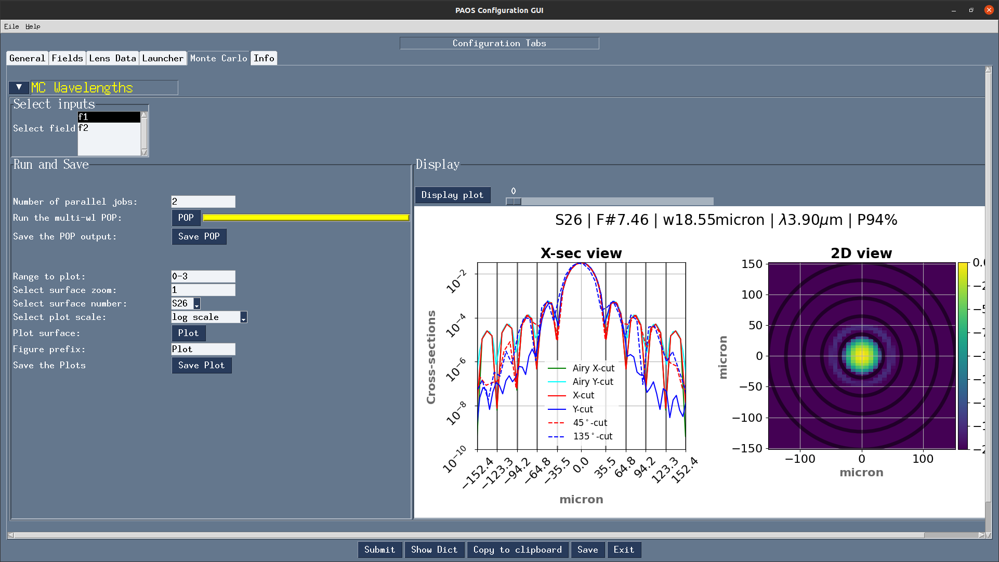
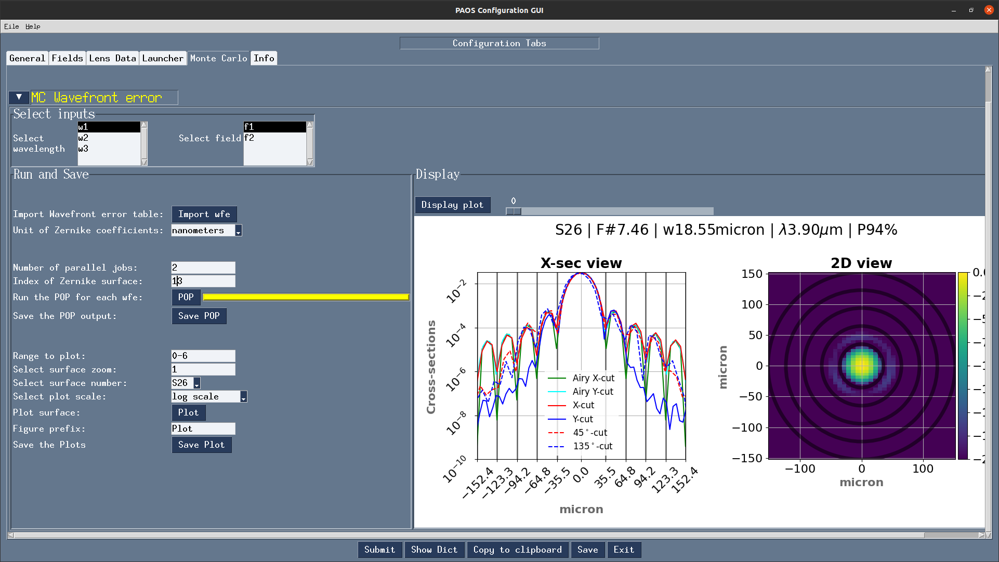

.. _Input system:

Input system
=======================

`PAOS` has a generic input system to be used by anyone expert in Computer Aided Design (CAD).

Its two pillars are

#. The :ref:`Configuration file`
    A .ini configuration file with structure similar to that of Zemax OpticStudio :math:`^{©}`;
#. The :ref:`GUI editor`
    A GUI to dynamically modify the configuration file and launch instant POP simulations

This structure allows the user to write configuration files from scratch or edit existing ones in a dynamic way, and
to launch automized POP simulations that reflect the edits without requiring advanced programming skills.

From a broad perspective, this input system has two advantages:

#. It can be used to design and test any optical system with relative ease.
    Outside the Ariel Consortium, `PAOS` is currently used to simulate the optical performance of the
    stratospheric balloon-borne experiment EXCITE (`Tucker et al., The Exoplanet Climate Infrared TElescope (EXCITE)
    (2018) <https://doi.org/10.1117/12.2314225>`_).

    .. tip::
        The interested reader may refer to the section :ref:`Plotting results` to see an example of `PAOS` results for
        EXCITE.

#. It helped in validating the `PAOS` code against existing simulators.
    .. tip::
        The interested reader may refer to the section :ref:`Validation` to see how we validated `PAOS` using the Hubble optical system

.. _Configuration file:

Configuration file
----------------------

The configuration file is an .ini file structured into four different sections:

#. DEFAULT
    Optional section, not used

#. :ref:`general section`
#. :ref:`wavelengths section`
#. :ref:`fields section`
#. :ref:`lenses section`

.. note::
    `PAOS` defines units as follows:

    #. Lens units: meters
    #. Angles units: degrees
    #. Wavelength units: micron

.. _general section:

General
^^^^^^^^^^^
Section describing the general simulation parameters and `PAOS` units

.. list-table:: [general]
   :widths: 40 40 100
   :header-rows: 1

   * - keyword
     - type
     - description

   * - project
     - string
     - A string defining the project name

   * - version
     - string
     - Project version (e.g. 1.0)

   * - grid_size
     - int
     - Grid size for simulation

       Must be in [64, 128, 512, 1024]

   * - zoom
     - int
     - Zoom size

       Must be in [1, 2, 4, 8, 16]

   * - lens_unit
     - string
     - Unit of lenses

       Must be 'm'

   * - tambient
     - float
     - Ambient temperature in Celsius

   * - pambient
     - float
     - Ambient pressure in atmospheres

Below we report a snapshot of this section from the Ariel AIRS CH1 configuration file

.. _general:
.. figure:: general.png
   :align: center

   `General`

.. _wavelengths section:

Wavelengths
^^^^^^^^^^^^^
Section listing the wavelengths to simulate (preferably in increasing order)

.. list-table:: [wavelengths]
   :widths: 40 40 100
   :header-rows: 1

   * - keyword
     - type
     - description

   * - w1
     - float
     - First wavelength

   * - w2
     - float
     - Second wavelength

   * - ...
     - ...
     - ...

Below we report a snapshot of this section from the Ariel AIRS CH1 configuration file

.. _wavelengths:
.. figure:: wavelengths.png
   :align: center

   `Wavelengths`

.. _fields section:

Fields
^^^^^^^^^^^^^
Section listing the input fields to simulate

.. list-table:: [fields]
   :widths: 40 40 100
   :header-rows: 1

   * - keyword
     - type
     - description

   * - f1
     - float, float
     - Field 1:

       sagittal (x) and tangential (y) angle

   * - f2
     - float, float
     - Field 2:

       sagittal (x) and tangential (y) angle

   * - ...
     - ...
     - ...

Below we report a snapshot of this section from the Ariel AIRS CH1 configuration file

.. _fields:
.. figure:: fields.png
   :align: center

   `Fields`

.. _lenses section:

Lens_xx
^^^^^^^^^^^^^

Lens data sections describing how to define the different optical surfaces (INIT, Coordinate Break,
Standard, Paraxial Lens, ABCD and Zernike) and their required parameters.

.. list-table:: [lens_xx]
   :widths: 30 20 20 20 20 20 20 20 20 40
   :header-rows: 1
   :align: center
   :class: longtable

   * - SurfaceType
     - Comment
     - Radius
     - Thickness
     - Material
     - Save
     - Ignore
     - Stop
     - aperture
     - Par1..N

   * - INIT
     - string, this surface name
     - None
     - None
     - None
     - None
     - None
     - None
     - list
     - None

   * - Coordinate Break
     - ...
     - None
     - float
     - None
     - Bool
     - Bool
     - Bool
     - list
     - None

   * - Standard
     - ...
     - float
     - float
     - MIRROR, others
     - Bool
     - Bool
     - Bool
     - list
     - None

   * - Paraxial Lens
     - ...
     - None
     - float
     - None
     - Bool
     - Bool
     - Bool
     - list
     - Par1 = focal length (float)

   * - ABCD
     - ...
     - None
     - float
     - None
     - Bool
     - Bool
     - Bool
     - list
     - Par1..4 = Ax, Bx, Cx, Dx (sagittal)

       Par5..8 = Ay, By, Cy, Dy (tangential)

   * - Zernike

       in addition to standard parameters defines:

       Zindex: polynomial index starting from 0

       Z: coefficients in units of wave

     - ...
     - None
     - None
     - None
     - Bool
     - Bool
     - Bool
     - None
     - Par1 = wave (in micron)

       Par2 = ordering, can be standard, ansi, noll, fringe

       Par3 = Normalisation, can be True or False

       Par4 = Radius of support aperture of the poly

       Par5 = origin, can be x (counterclockwise positive from x axis) or y (clockwise positive from y axis)

.. note::

    #. Set the `Ignore` flag to 1 to skip the surface
    #. Set the `Stop` flag to 1 to make the surface a Stop (see :ref:`Stops`)
    #. Set the `Save` flat to 1 to later save the output for the surface

.. note::
    The `aperture` keyword is a list with the following format:

    * aperture = shape type, wx, wy, xc, yc
    * shape: either ‘elliptical’ or ‘rectangular’
    * type: either ‘aperture’ or ‘obscuration’
    * wx, wy: semi-axis of elliptical shapes, or full length of rectangular shape sides
    * xc, yc: coordinates of aperture centre

    Example:
    aperture = elliptical aperture, 0.5, 0.3, 0.0, 0.0

Below we report a snapshot of the first lens data section from the Ariel AIRS CH1 configuration file

.. _lens_xx:
.. figure:: lenses.png
   :align: center

   `Lens_xx`

.. _Parse configuration file:

Parse configuration file
^^^^^^^^^^^^^^^^^^^^^^^^^^^^^

`PAOS` implements the method :func:`~paos.paos_parseconfig.parse_config` that parses the input file, prepares the
simulation run and returns the simulation parameters and the optical chain. This method can be called as in the example
below.

Example
~~~~~~~~~~~
Code example to parse a `PAOS` configuration file.

.. code-block:: python

        from paos.paos_parseconfig import parse_config
        pup_diameter, parameters, wavelengths, fields, opt_chains = parse_config('path/to/ini/file')

.. _GUI editor:

GUI editor
----------------------

.. _GeneralTab:
.. figure:: GeneralTab.png
   :align: center

   `General Tab`

.. _FieldsTab:
.. figure:: FieldsTab.png
   :align: center

   `Fields Tab`

.. _LensDataTab:
.. figure:: LensDataTab.png
   :align: center

   `Lens data Tab`

.. _ZernikeTab:
.. figure:: ZernikeTab.png
   :align: center

   `Zernike Tab`

.. _LauncherTab:
.. figure:: LauncherTab.png
   :align: center

   `Launcher Tab`

.. _MonteCarloTab1:

   `Monte Carlo Tab (1)`

.. _MonteCarloTab2:

   `Monte Carlo Tab (2)`
