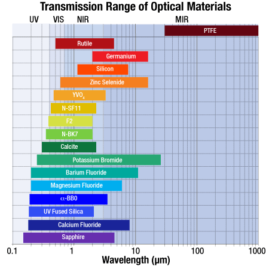

.. _Materials description:

Materials description
=======================

Brief description of dispersion of light by optical materials and how it is implemented in `PAOS`.

In `PAOS`, this is handled by the class :class:`~paos.util.material.Material`.

Light dispersion
------------------

In optics, dispersion is the phenomenon in which the phase velocity of a wave depends on its frequency:

.. math::
    v={\frac {c}{n}}

where :math:`c` is the speed of light in a vacuum and :math:`n` is the refractive index of the dispersive medium.
Physically, dispersion translates in a loss of kinetic energy through absorption. The absorption by the dispersive medium
is different at different wavelengths, changing the angle of refraction of different colors of light as seen in the spectrum
produced by a dispersive :ref:`prism` and in chromatic aberration of :ref:`thick lenses`.

This can be seen in geometric optics from Snell's law:

.. math::
    \frac{sin(\theta_2)}{sin(\theta_1)} = \frac{n_1}{n_2}

that describes the relationship between the angle of incidence :math:`\theta_1` and refraction :math:`\theta_2` of light
passing through a boundary between an isotropic medium with refractive index :math:`n_1` and another with :math:`n_2`.

For air and optical glasses, for visible and infra-red light refraction indices :math:`n` decrease with increasing
:math:`\lambda` (`normal dispersion`), i.e.

.. math::
    \frac{d n}{d \lambda} < 0

while for ultraviolet the opposite behaviour is typically the case (anomalous dispersion).

See later in :ref:`Plotting refractive indices` for the dispersion behaviour of supported optical materials in `PAOS`.

.. _Sellmeier:

Sellmeier equation
---------------------

The Sellmeier equation is an empirical relationship for the dispersion of light in a particular transparent
medium such as an optical glass in function of wavelength. In its original form (Sellmeier, 1872) it is given as

.. math::
    n^{2}(\lambda )=1+\sum _{i}{\frac {K_{i}\lambda ^{2}}{\lambda ^{2}-L_{i}}}
    :label:

where :math:`n` is the refractive index, :math:`\lambda` is the wavelength and :math:`K_i` and :math:`\sqrt{L_i}`
are the Sellmeier coefficients, determined from experiments.

Physically, each term of the sum represents an absorption resonance of strength :math:`K_i` at wavelength
:math:`\sqrt{L_i}`. Close to each absorption peak, a more precise model of dispersion is required to avoid non-physical
values.

`PAOS` implements the Sellmeier 1 equation (Zemax OpticStudio :math:`^{©}` notation) to estimate the index of refraction
relative to air for a particular optical glass at the glass reference temperature and pressure

.. math::
    T_{ref} = 20^{\circ} K \\
    P_{ref} = 1 \ \textrm{atm}
    :label:

This form of the original equation consists of only three terms and is given as

.. math::
    n^{2}(\lambda )=1+{\frac {K_{1}\lambda ^{2}}{\lambda ^{2}-L_{1}}}+{\frac {K_{2}\lambda ^{2}}{\lambda ^{2}-L_{2}}}+{\frac {K_{3}\lambda ^{2}}{\lambda ^{2}-L_{3}}}
    :label: Sellmeier 1

The resulting refracting index should deviate by less than :math:`10^{-6}` from the actual refractive index which is order
of the homogeneity of a glass sample (see e.g. `Optical properties <http://oharacorp.com/o2.html>`_).

Example
~~~~~~~~~

Code example to use :class:`~paos.util.material.Material` to estimate the index of refraction of borosilicate crown
glass (known as `BK7`) for a range of wavelengths from the visible to the infra-red.

.. code-block:: python

        import numpy as np
        from paos.util.material import Material

        glass = 'bk7'

        mat = Material(wl=np.linspace(0.5, 8.0, 10))
        print('Sellmeier refractive index: ')
        material = mat.materials[glass.upper()]
        mat.sellmeier(material['sellmeier'])

Temperature and refractive index
-----------------------------------

Changes in the temperature of the dispersive medium affect the refractive index. The temperature coefficient
of refractive index is defined as the deviation :math:`dn/dT` from the curve and depends from both wavelength and
temperature.

The temperature coefficient values can be given as absolute (as measured under vacuum) and relative (as measured
at ambient air (dry air at standard pressure).

`PAOS` estimates the air reference index of refraction as

.. math::
    n_{ref} = 1.0 + 1.0 \cdot 10^{-8} \left(6432.8 + \frac{2949810 \lambda^2}{146 \lambda^2 - 1} + 25540 \frac{\lambda^2}{41 \lambda^2 - 1}\right)
    :label:

where :math:`\lambda` is in units of micron, at the reference temperature :math:`T = 15 ^{\circ} K` and standard pressure.
Under different temperatures and pressures, `PAOS` rescales this reference index using this formula

.. math::
    n_{air} = 1 + \frac{P \left(n_{ref} - 1\right)} {1.0 + 3.4785 \cdot 10^{-3} (T - 15)}
    :label:

The absolute temperature coefficient for a different medium can be calculated from the relative index as
(see e.g. `Optical properties <http://oharacorp.com/o2.html>`_).

.. math::
    \frac{d n}{d T}, \textrm{absolute} =  \frac{d n}{d T}, \textrm{relative} + n \left(\frac{d n}{d T}, \textrm{air}\right)
    :label:

`PAOS` calculates the refractive index of an optical material at a given pressure and temperature as

.. math::
    n(\Delta T) = \frac{n^2 - 1}{2 n} D_0 \Delta T + n
    :label:

where :math:`\Delta T` is given by the difference between the material operative temperature math:`T_{oper}` and the
reference temperature :math:`T_{ref}`, :math:`n` is the refractive index as estimated using :eq:`Sellmeier 1` and
:math:`D_0` is a temperature constant of the material.

Example
~~~~~~~~~~

Code example to use :class:`~paos.util.material.Material` to estimate the index of refraction of borosilicate crown
glass (known as `BK7`) at reference and operating temperature.

.. code-block:: python

        from paos.util.material import Material

        wl = 1.95  # micron
        mat = Material(wl)
        glass = 'bk7'
        nmat0, nmat = mat.nmat(glass)
        print('index of refraction at reference temperature = {:.4f}'.format(nmat0))
        print('index of refraction at operating temperature = {:.4f}'.format(nmat))

Supported materials
-------------------------

`PAOS` supports a variety of optical materials (list is still updating), among which:

#. CAF2 (calcium fluoride)
#. SAPPHIRE (mainly aluminium oxide (:math:`\alpha-Al_2 O_3`) )
#. ZNSE (zinc selenide)
#. BK7 (borosilicate crown glass)
#. SF11 (a dense-flint glass)
#. BAF2 (barium flouride)

The relevant ones for the `Ariel` space mission are all of them except BAF2. A detailed description of the optical
properties of these materials is beyond the scope of this documentation. However, for reference,
:numref:`substrate_thorlabs` reports their transmission range (from `Thorlabs, Optical Substrates <https://www.thorlabs.com/newgrouppage9.cfm?objectgroup_id=6973>`_).

.. _substrate_thorlabs:

   `Transmission range of optical substrates (Thorlabs)`

Example
~~~~~~~~~~~

Code example to use :class:`~paos.util.material.Material` to print all available optical materials.

.. code-block:: python

        from paos.util.material import Material

        wl = 1.95  # micron
        mat = Material(wl)
        print('Supported materials: ')
        print(*mat.materials.keys(), sep = "\n")

Example
~~~~~~~~~

Code example to use :class:`~paos.util.material.Material` to plot the refractive index for all available optical
materials, at their operating and reference temperature.

.. code-block:: python

        from paos.util.material import Material

        mat = Material(wl=np.linspace(0.5, 8.0, 100))
        mat.plot_relative_index(material_list=mat.materials.keys())

:numref:`matplot` reports the resulting plot as of 16th December 2021.

.. _matplot:

.. figure:: mat.png
   :width: 1200
   :align: center

   `Relative index of supported materials`