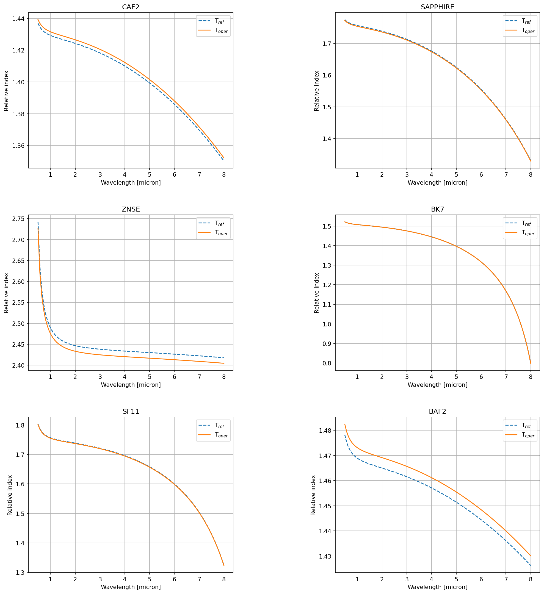

.. _Materials description:

=======================
Materials description
=======================

Supported materials
-------------------------

.. code-block:: python

        from paos.util.material import Material

        wl = 1.95  # micron
        mat = Material(wl)
        print('Supported materials: ')
        print(*mat.materials.keys(), sep = "\n")

Sellmeier equation
---------------------

Index of refraction
----------------------------

Example
^^^^^^^^^^^^^^^^^^^^^^^^^^^^^^^^

.. code-block:: python

        from paos.util.material import Material

        wl = 1.95  # micron
        mat = Material(wl)
        glass = 'bk7'
        print('absolute index of refraction {:.4f} \nindex relative to air {:.4f}'.format(
            *mat.nmat(glass)), sep = "\n")

Plotting
---------------

.. code-block:: python

        import numpy as np
        from paos.util.material import Material

        wl = np.linspace(0.5, 8.0, 100)  # micron
        mat = Material(wl)
        mat.plot_relative_index(material_list=mat.materials.keys())

