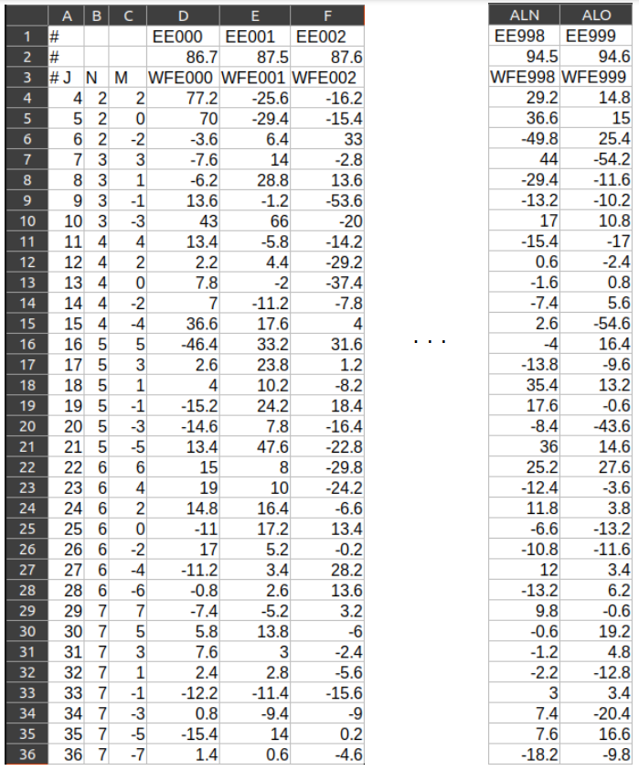
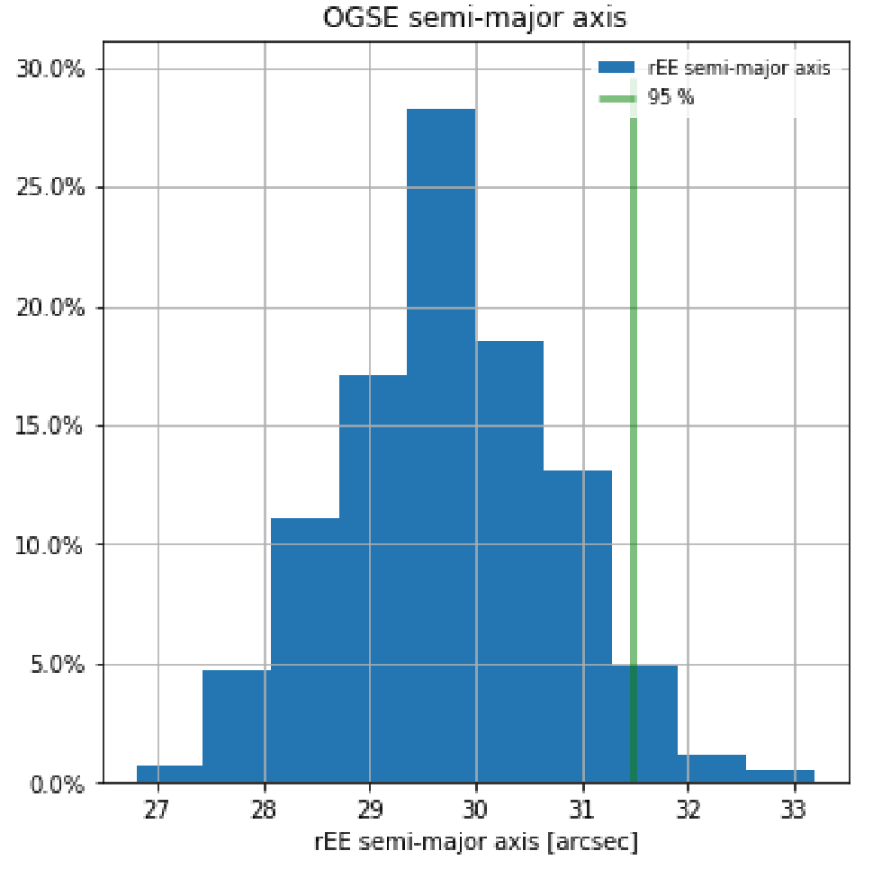

.. _Monte Carlo simulations:

Monte Carlo simulations
========================

``PAOS`` is designed to easily accommodate customized simulations such as Monte Carlo runs to test the performance of
an optical system with varying parameters. This is particularly useful as it overcomes one major drawback from
using commercial propagation software such as Zemax OpticStudio, which requires preliminary knowledge of
Zemax Programming Language (ZPL). Instead, ``PAOS`` can be used `out of the box` as a standard Python
library, interleaved with user-written code to suit a specific simulation. Moreover, ``PAOS``'s routines can be
easily run in parallel by leveraging standard Python libraries such as joblib and tqdm, for computational efficiency.

Multi-wavelength simulations
------------------------------

``PAOS`` uses the method :func:`~paos.core.parseConfig.parse_config` to parse the .ini configuration file and return a
list of optical chains, where each list entry is a dictionary of the optical surfaces in the file, estimated at the
given wavelength.

This output can be readily used to run POP simulations at each different wavelength, to test that the system properties
and optical performance are always compliant to specification. For instance, wavelength-dependent total throughput
for systems with optical diaphragms and variations in effective focal ratio for systems with diffractive elements.

Wavefront error simulations
----------------------------------

``PAOS`` can be used to evaluate the performance of an optical system for a given number of wavefront error realizations,
to test the compatibility of the aberrated PSFs with some performance requirement. For instance, ``PAOS`` provides an
ensemble of wavefront error realizations (see :numref:`wfe_realizations`) that are compatible or nearly compatible with
the encircled energy (EE) requirement at the `Ariel` telescope exit pupil.

.. _wfe_realizations:

   `Wfe realizations table`

The recommended way to access this dataset is using the astropy method :func:`~astropy.io.ascii` as in the following code example.

.. code-block:: python

        import os
        from astropy.io import ascii

        wfe_file = os.path.join('path/to/wfe_file.csv')
        wfe = ascii.read(wfe_file)

The whole set provides an effective way to test subsystems optical performances ahead of a measurement of the
surface deviation of the Ariel telescope assembly (TA).

For example, it has been used to derive the rEE (radius of encircled energy) requirement for the `Ariel` Optical Ground
Support Equipment (OGSE), whose primary goal is to provide end-to-end testing of the integrated `Ariel` telescope, optical
bench and spectrometers. To account for gravity effect (`potato chip`), vertical astigmatism was fixed to 3 :math:`\mu m`
root mean square (r.m.s.) as a rough estimate that will be replaced in the future with an input from
Structural, Thermal and Optical Performance (STOP) analysis.

``PAOS`` was used to simulate the wavefront propagation through the OGSE module at :math:`500 nm`, where
diffraction effects are smallest. To simulate the OGSE beam, the `Ariel` primary mirror M1 was illuminated with a perfect
beam with footprint :math:`1/4` the M1 diameter and the OGSE beam expander was modeled as a lens doublet giving an
expansion of :math:`4`.

Below, we report the histogram of aperture sizes that give an EE :math:`\sim 90 \%` at the OGSE exit pupil. The
difference between these aperture sizes and the TA rEE requirement informs on how aberrated the OGSE beam can be.

.. _ogse90:

   `Histogram of aperture sizes for OGSE`
