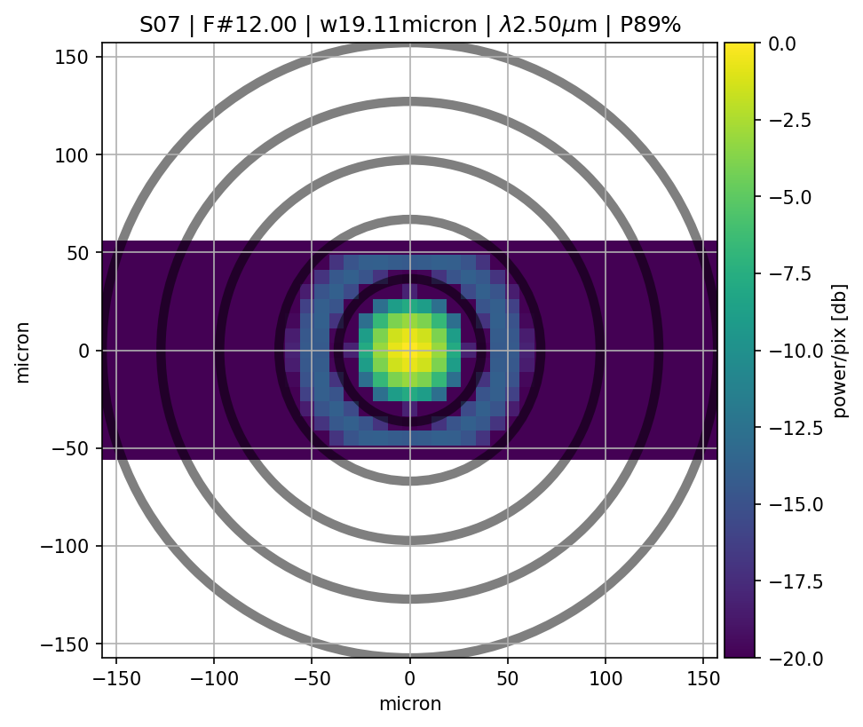
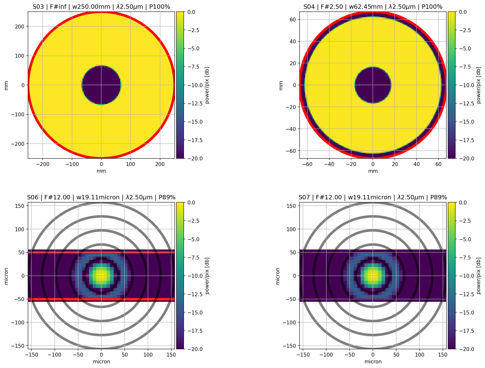

.. _Plotting results:

Plotting results
=======================

Base plot
-------------

Given the POP simulation output dict, plots the squared amplitude of the
wavefront at the given optical surface.

:numref:`Excite_base_plot`

.. _Excite_base_plot:

   `PSF at EXCITE image plane`

Example
~~~~~~~~~~

.. code-block:: python

        from matplotlib import pyplot as plt
        from paos.paos_parseconfig import ParseConfig
        from paos.paos_run import run
        from paos.paos_plotpop import simple_plot

        pup_diameter, general, fields, opt_chain = ParseConfig('path/to/conf/file')
        ret_val = run(pup_diameter, 1.0e-6 * general['wavelength'], general['grid size'],
        general['zoom'], fields['0'], opt_chain)
        fig, ax = plt.subplots(nrows=1, ncols=1, figsize=(8, 8))
        key = list(ret_val.keys())[-1]  # plot at last optical surface
        item = ret_val[key]
        simple_plot(fig, ax, key=key, item=item, ima_scale='log')
        plt.show()

POP plot
------------

Given the POP simulation output dict, plots the squared amplitude of the
wavefront at all the optical surfaces.

:numref:`Excite_POP_plot`

.. _Excite_POP_plot:

   `Full POP plot for EXCITE`

Example
~~~~~~~~~

.. code-block:: python

        from paos.paos_parseconfig import ParseConfig
        from paos.paos_run import run
        from paos.paos_plotpop import plot_pop

        pup_diameter, general, fields, opt_chain = ParseConfig('path/to/conf/file')
        ret_val = run(pup_diameter, 1.0e-6 * general['wavelength'], general['grid size'],
        general['zoom'], fields['0'], opt_chain)
        plot_pop(ret_val, ima_scale='log', ncols=3, figname='path/to/output/plot')

