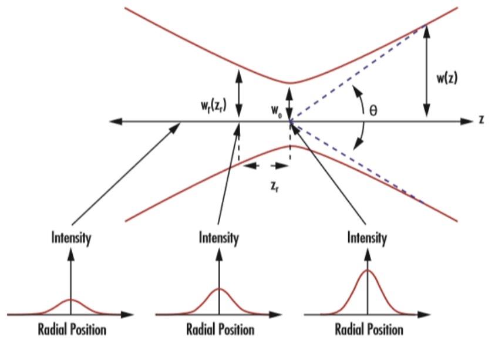
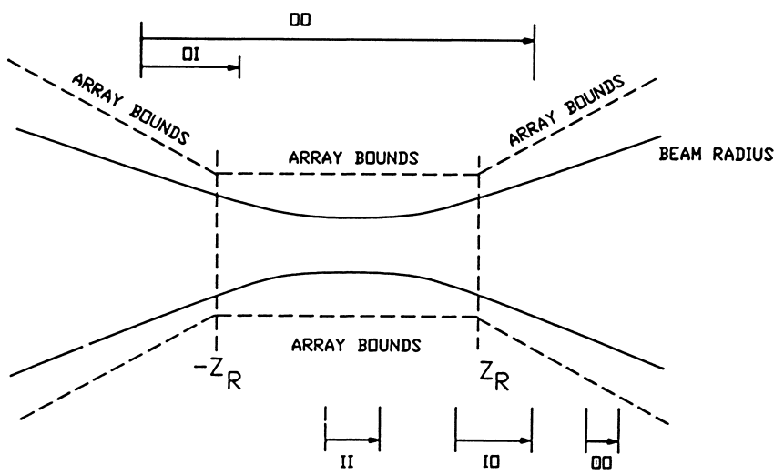
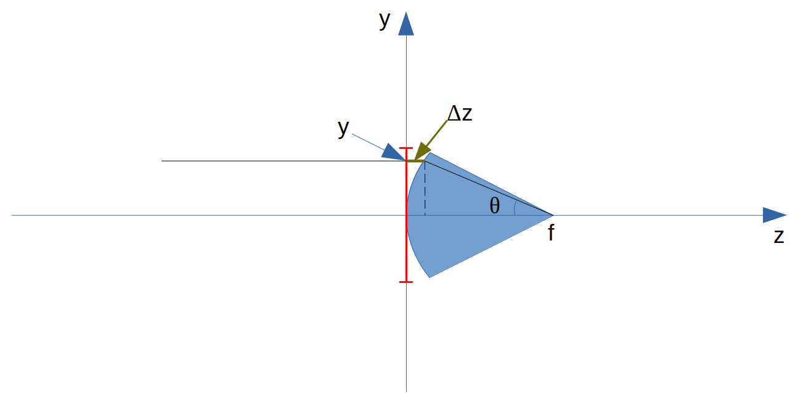
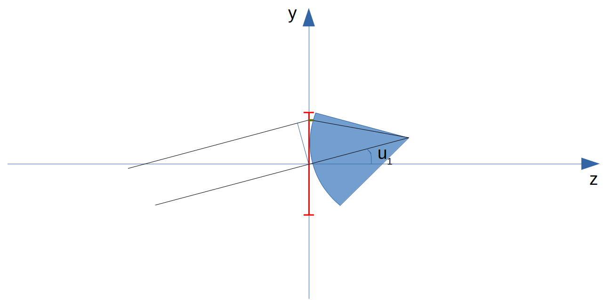
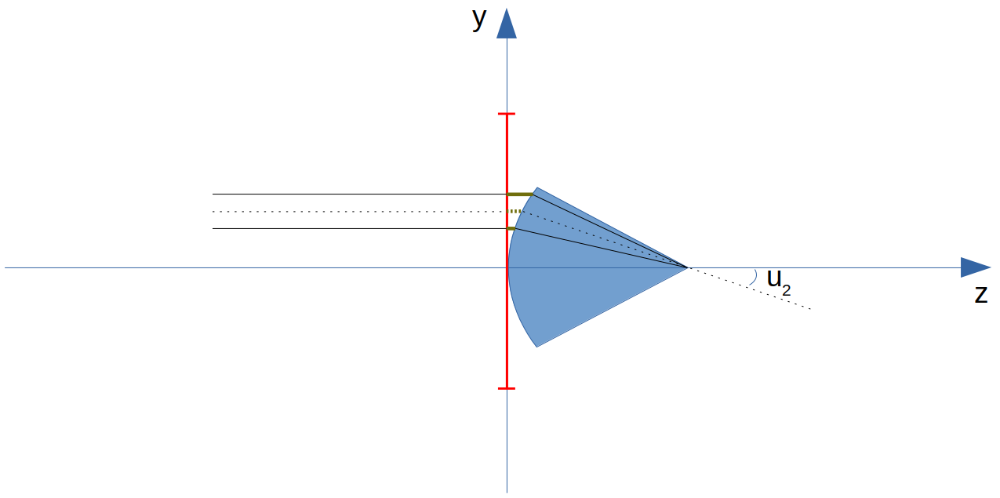

.. _POP description:

POP description
=======================

Brief description of some concepts of physical optics wavefront propagation (POP) and how they are implemented in `PAOS`.

In `PAOS`, this is handled by the class :class:`~paos.paos_wfo.WFO`.

General diffraction
--------------------------------

Diffraction is the deviation of a wave from the propagation that would be followed by a straight ray,
which occurs when part of the wave is obstructed by the presence of a boundary. Light undergoes diffraction
because of its wave nature.

The Huygens-Fresnel principle is often used to explain diffraction intuitively. Each point on the wavefront
propagating from a single source can be though of as being the source of spherical secondary wavefronts (wavelets).
The combination of all wavelets cancels except at the boundary, which is locally parallel to the initial wavefront.

However, if there is an object or aperture which obstructs some of the wavelets, changing their phase or amplitude,
these wavelets interfere with the unobstructed wavelets, resulting in the diffraction of the wave.

.. _Fresnel diffraction theory:

Fresnel diffraction theory
--------------------------------

Fresnel diffraction theory requires the following conditions to be met
(see e.g. `Lawrence et al., Applied Optics and Optical Engineering, Volume XI (1992) <https://ui.adsabs.harvard.edu/abs/1992aooe...11..125L>`_):

#. aperture sized significantly larger than the wavelength
#. modest numerical apertures
#. thin optical elements

`PAOS` is implemented assuming that Fresnel diffraction theory holds.

Coordinate breaks
-----------------------

Coordinate breaks are implemented as follows:

#. Decenter by :math:`x_{dec}, y_{dec}`
#. Rotation XYZ (first X, then Y, then Z)

The rotation is intrinsic (X, then around new Y, then around new Z).

To transform the sagittal coordinates (:math:`x, u_{x}`) and the tangential coordinates (:math:`y, u_{y}`),
define the position vector

.. math::
    \vec{R_0} = (x-x_{dec}, y-y_{dec}, 0)
    :label:

and the unit vector of the light ray

.. math::
    \vec{n_0} = (z u_{x}, z u_{y}, z)
    :label:

where z is an appropriate projection of the unit vector such that :math:`u_{x}` and :math:`u_{y}` are the tangent of
the angles (though we are in the paraxial approximation and this might not be necessary).

.. note::
    z does not need to be calculated because it gets normalised away.

The position on the rotated :math:`x', y'` plane would be :math:`\vec{R_0}'=(x', y', 0)` and the relation is

.. math::
    U^{T} \vec{R_0} + \rho U^{T} \vec{n_0} = \vec{R_0}'
    :label:

that can be solved as

.. math::
    U^{T} \vec{n_0} = \vec{n_0}' = z'(u_x', u_y', 1) \\
    \rho = -\frac{z_0'}{z'}
    :label:

Example
~~~~~~~~~~~~~

Code example to use :func:`~paos.paos_coordinatebreak.coordinate_break` to simulate a coordinate break where the input
field is centered on the origin and has null angles :math:`u_{s}` and :math:`u_{t}` and is subsequently decentered on
the Y axis by :math:`y_{dec} = 10.0 \ \textrm{mm}` and rotated around the X axis by :math:`x_{rot} = 0.1 ^{\circ}`.

.. jupyter-execute::
        :hide-code:
        :stderr:
        :hide-output:

        import os, sys
        paospath = "~/git/PAOS"
        if not os.path.expanduser(paospath) in sys.path:
            sys.path.append( os.path.expanduser(paospath) )

        import paos

.. jupyter-execute::

        import numpy as np
        from paos.paos_coordinatebreak import coordinate_break

        field = {'us': 0.0, 'ut': 0.0}
        vt = np.array([0.0, field['ut']])
        vs = np.array([0.0, field['us']])

        xdec, ydec = 0.0, 10.0e-3  # m
        xrot, yrot, zrot = 0.1, 0.0, 0.0  # deg
        vt, vs = coordinate_break(vt, vs, xdec, ydec, xrot, yrot, zrot, order=0.0)

        print(vs, vt)

.. _Gaussian beams:

Gaussian beams
--------------------------

For a Gaussian beam, i.e. a beam with an irradiance profile that follows an ideal Gaussian distribution
(see e.g. `Smith, Modern Optical Engineering, Third Edition (2000) <https://spie.org/Publications/Book/387098>`_)

.. math::
    I(r) = I_0 e^{-\frac{2 r^2}{w(z)^2}} = \frac{2 P}{\pi w(z)^2} e^{-\frac{2 r^2}{w(z)^2}}
    :label:

where :math:`I_0` is the beam intensity on axis, :math:`r` is the radial distance and :math:`w` is the radial
distance at which the intensity falls to :math:`I_0 / e^2`, i.e., to 13.5 percent of its value on axis.

.. note::
    :math:`w(z)` is the semi-diameter of the beam and it encompasses :math:`86.5 \%` of the beam power.

Due to diffraction, a Gaussian beam will converge and diverge from the beam waist :math:`w_0`,
an area where the beam diameter reaches a minimum size, hence the dependence of :math:`w(z)` on z,
the longitudinal distance from the waist :math:`w_0` to the plane of :math:`w(z)`, henceforward "distance to focus".

A Gaussian beam spreads out as

.. math::
    w(z)^2 = w_0^2 \left[ 1 + \left(\frac{\lambda z}{\pi w_0^2} \right)^2 \right] = w_0^2 \left[ 1 + \left(\frac{z}{z_R} \right)^2 \right]
    :label:

where :math:`z_R` is the :ref:`Rayleigh distance`.

A Gaussian beam is defined by just three parameters: :math:`w_0`, :math:`z_R` and the divergence angle :math:`\theta`,
as in :numref:`gaussianbeams` (from `Edmund Optics, Gaussian beam propagation <https://www.edmundoptics.com/knowledge-center/application-notes/lasers/gaussian-beam-propagation/>`_).

.. _gaussianbeams:

   `Gaussian beam diagram`

The complex amplitude of a Gaussian beam is of the form
(see e.g. `Lawrence et al., Applied Optics and Optical Engineering, Volume XI (1992) <https://ui.adsabs.harvard.edu/abs/1992aooe...11..125L>`_)

.. math::
    a(r, 0) = e^{-\frac{r^2}{w_0^2}} e^{-\frac{j k r^2}{R}}
    :label:

where :math:`k` is the wavenumber and :math:`R` is the radius of the quadratic phase factor, henceforward "phase radius".
This reduces to

.. math::
    a(r, 0) = e^{-\frac{r^2}{w_0^2}}
    :label:

at the waist, where the wavefront is planar (:math:`R \rightarrow \infty`).

.. _Rayleigh distance:

Rayleigh distance
~~~~~~~~~~~~~~~~~~~~~~~~~~~~~~~~~~~~~

The Rayleigh distance of a Gaussian beam is defined as the value of z where the cross-sectional area of the beam is
doubled. This occurs when w(z) has increased to :math:`\sqrt{2} w_0`.

Explicitly:

.. math::
    z_R = \frac{\pi w_0^2}{\lambda}
    :label:

The physical significance of the Rayleigh distance is that it indicates the region where the curvature of the wavefront
reaches a minimum value. Since

.. math::
    R(z) = z + \frac{z_R^2}{z}
    :label: eq:radius

in the Rayleigh range, the phase radius is :math:`R = 2 z_R`.

From the point of view of the `PAOS` code implementation, the Rayleigh distance is used to develop a concept of near- and far-field,
to define specific propagators (see :ref:`Wavefront propagation`).

Gaussian beam propagation
~~~~~~~~~~~~~~~~~~~~~~~~~~~~~~~~~~~~~

To the accuracy of Fresnel diffraction, a Gaussian beam propagates as
(see e.g. `Lawrence et al., Applied Optics and Optical Engineering, Volume XI (1992) <https://ui.adsabs.harvard.edu/abs/1992aooe...11..125L>`_)

.. math::
    a(r, z) = e^{- j \left[k z - \theta(z)\right]} e^{-\frac{r^2}{w(z)^2}} e^{-\frac{j k r^2}{R(z)}}
    :label:

where :math:`\theta(z)` is a piston term referred to as the phase factor, given by

.. math::
    \theta(z) = tan^{-1}\left(\frac{z_R}{z}\right)
    :label:

:math:`\theta(z)` varies from :math:`\pi` to :math:`-\pi` when propagating from :math:`z = -\infty`
to :math:`z = \infty`.

The Gaussian beam propagation can also be described using ABCD matrix optics. A complex
radius of curvature :math:`q(z)` is defined as:

.. math::
    \frac{1}{q(z)} = \frac{1}{R(z)} - \frac{j \lambda}{\pi n w(z)^2}
    :label:

Propagating a Gaussian beam from some initial position (1) through an optical system (ABCD) to a final position (2)
gives the following transformation:

.. math::
    \frac{1}{q_2} = \frac{C + D/q_1}{A + B/q_1}
    :label:

Example
~~~~~~~~~~~~~

Code example to use :class:`~paos.paos_wfo.WFO` to estimate Gaussian beam properties for a given beam with diameter
:math:`d = 1.0` m, before and after inserting a Paraxial lens with focal length :math:`f = 1.0` m, and after
propagating to the lens focus.

.. jupyter-execute::
        :stderr:

        from paos.paos_wfo import WFO

        beam_diameter = 1.0  # m
        wavelength = 3.0e-6
        grid_size = 512
        zoom = 4

        wfo = WFO(beam_diameter, wavelength, grid_size, zoom)

        print('Pilot Gaussian beam properties\n')

        print('Before lens\n')
        print(f'Beam waist: {wfo.w0:.1e}')
        print(f'Beam waist at current beam position: {wfo.wz:.1f}')
        print(f'z-coordinate of the beam waist: {wfo.zw0:.1f}')
        print(f'Rayleigh distance: {wfo.zr:.1e}')
        print(f'Focal ratio: {wfo.fratio}')

        fl = 1.0  # m
        wfo.lens(lens_fl=fl)

        print('\nAfter lens\n')
        print(f'Beam waist: {wfo.w0:.1e}')
        print(f'Beam waist at current beam position: {wfo.wz:.1f}')
        print(f'z-coordinate of the beam waist: {wfo.zw0:.1f}')
        print(f'Rayleigh distance: {wfo.zr:.1e}')
        print(f'Focal ratio: {wfo.fratio:.1f}')

        wfo.propagate(dz=fl)

        print('\nAfter propagation to lens focus\n')
        print(f'Beam waist: {wfo.w0:.1e}')
        print(f'Beam waist at current beam position: {wfo.wz:.1e}')
        print(f'z-coordinate of the beam waist: {wfo.zw0:.1f}')
        print(f'Rayleigh distance: {wfo.zr:.1e}')
        print(f'Focal ratio: {wfo.fratio:.1f}')

Gaussian beam magnification
~~~~~~~~~~~~~~~~~~~~~~~~~~~~~~~~~~~~~

The Gaussian beam magnification can also be described using ABCD matrix optics.
Using the definition given in :ref:`Magnification`, in this case

.. math::
      A = M \\
      D = 1/M \\
      B = C = 0
    :label:

Therefore, for the complex radius of curvature we have that

.. math::
    q_2 = M^2 q_1
    :label:

Using the definition of :math:`q(z)` it follows that

#. :math:`R_2 = M^2 R_1`
#. :math:`w_2 = M w_1`

for the phase radius and the semi-diameter of the beam, while from the definition of Rayleigh
distance it follows that

#. :math:`z_{R,2} = M^2 z_{R,1}`
#. :math:`w_{0,2} = M w_{0,1}`
#. :math:`z_2  = M^2 z_1`

for the Rayleigh distance, the Gaussian beam waist and the distance to focus.

.. note::
    In the current version of `PAOS`, the Gaussian beam width is set along x. So, only the sagittal magnification changes
    the Gaussian beam properties. A tangential magnification changes only the curvature of the
    propagating wavefront.

Example
~~~~~~~~~~~~~

Code example to use :class:`~paos.paos_wfo.WFO` to simulate a magnification of the beam for the tangential direction
:math:`M_t = 3.0`, while keeping the sagittal direction unchanged (:math:`M_s = 1.0`).

.. jupyter-execute::
        :stderr:

        from paos.paos_wfo import WFO

        beam_diameter = 1.0  # m
        wavelength = 3.0e-6
        grid_size = 512
        zoom = 4

        wfo = WFO(beam_diameter, wavelength, grid_size, zoom)

        print('Before magnification\n')
        print(f'Beam waist: {wfo.w0}')

        Ms, Mt = 1.0, 3.0
        wfo.Magnification(Ms, Mt)

        print('\nAfter magnification\n')
        print(f'Beam waist: {wfo.w0}')

As a result, the semi-diameter of the beam increases three-fold.

Gaussian beam change of medium
~~~~~~~~~~~~~~~~~~~~~~~~~~~~~~~~~~~~~

As seen in :ref:`Medium change`, a change of medium from :math:`n_1` to :math:`n_2` can be described using an ABCD matrix with

.. math::
      A = 1 \\
      D = n_1/n_2 \\
      B = C = 0
    :label:

Therefore, for the complex radius of curvature we have that

.. math::
    q_2 = q_1 n_2/n_1
    :label:

Using the definition of :math:`q(z)` it follows that

#. :math:`R_2 = R_1 n_2/n_1`
#. :math:`w_2 = w_1`
#. :math:`z_{R,2} = z_{R,1} n_2/n_1`
#. :math:`w_{0,2} = w_{0,1}`
#. :math:`z_2 = z_1 n_2/n_1`

For the phase radius, the semi-diameter of the beam, the Rayleigh distance, the Gaussian beam waist and the distance to focus, respectively.

Moreover, since :math:`\lambda_{2} = \lambda_{1} n_2/n_1`, it follows that

.. math::
    f_{num, 2} = f_{num, 1} n_1/n_2
    :label:

Example
~~~~~~~~~~~~~

Code example to use :class:`~paos.paos_wfo.WFO` to simulate a change of medium from :math:`n_1 = 1.0` to :math:`n_2 = 1.5`,
to point out the change in distance to focus.

.. jupyter-execute::
        :stderr:

        from paos.paos_wfo import WFO

        beam_diameter = 1.0  # m
        wavelength = 3.0e-6
        grid_size = 512
        zoom = 4

        wfo = WFO(beam_diameter, wavelength, grid_size, zoom)
        fl = 1.0  # m
        wfo.lens(lens_fl=fl)

        print('Before medium change\n')
        print(f'Distance to focus: {wfo.distancetofocus:.1f}')

        n1, n2 = 1.0, 1.5
        wfo.ChangeMedium(n1n2=n1/n2)

        print('\nAfter medium change\n')
        print(f'Distance to focus: {wfo.distancetofocus:.1f}')

.. _Wavefront propagation:

Wavefront propagation
--------------------------

The methods for propagation are the hardest part of the problem of modelling the propagation through a
well-behaved optical system. A thorough discussion of this problem is presented in
`Lawrence et al., Applied Optics and Optical Engineering, Volume XI (1992) <https://ui.adsabs.harvard.edu/abs/1992aooe...11..125L>`_.
Here we discuss the relevant aspects for the `PAOS` code implementation.

Once an acceptable initial sampling condition is established and the propagation is initiated, the beam
starts to spread due to diffraction. Therefore, to control the size of the array so that beam aliasing
does not change much from the initial state it is important to choose the right propagator (far-field or near-field).

`PAOS` propagates the pilot Gaussian beam through all optical surfaces to calculate the beam width at all points in space.
The Gaussian beam acts as a surrogate of the actual beam and the Gaussian beam parameters inform the POP simulation.
In particular the :ref:`Rayleigh distance` :math:`z_R` is used to inform the choice of specific propagators.

Aliasing occurs when the beam size becomes comparable to the array size. Instead of adjusting the sampling
period to track exactly, it is more effective to have a region of constant sampling period near the beam
waist (constant coordinates system of the form :math:`\Delta x_2 = \Delta x_1`) and a linearly increasing
sampling period far from the waist (expanding coordinates system of the form
:math:`\Delta x_2 = \lambda |z|/M \Delta x_1`).

For a given point, there are four possibilities in moving from inside or outside to inside or outside the
Rayleigh range (RR), defined as the region between :math:`-z_R` and :math:`z_R` from the beam waist:

.. math::
    \textrm{inside} \leftrightarrow |z - z(w)| \leq z_R \\
    \textrm{outside} \leftrightarrow |z - z(w)| > z_R
    :label: eq:insideout

The situation is described in :numref:`propagators`, taken from
`Lawrence et al., Applied Optics and Optical Engineering, Volume XI (1992) <https://ui.adsabs.harvard.edu/abs/1992aooe...11..125L>`_.

.. _propagators:

   `Wavefront propagators`

Explicitly, these possibilities are:

#. II(:math:`z_1`, :math:`z_2`): inside RR to inside RR
#. IO(:math:`z_1`, :math:`z_2`): inside RR to outside RR
#. OI(:math:`z_1`, :math:`z_2`): outside RR to inside RR
#. OO(:math:`z_1`, :math:`z_2`): outside RR to outside RR

To move from any point in space to any other, following `Lawrence et al., Applied Optics and Optical Engineering, Volume XI (1992) <https://ui.adsabs.harvard.edu/abs/1992aooe...11..125L>`_,
`PAOS` implements three primitive operators:

#. plane-to-plane (PTP)
#. waist-to-spherical (WTS)
#. spherical-to-waist (STW)

Using these primitive operators, `PAOS` implements all possible propagations:

#. II(:math:`z_1`, :math:`z_2`) = PTP(:math:`z_2-z_1`)
#. IO(:math:`z_1`, :math:`z_2`) = WTS(:math:`z_2-z(w)`) PTP(:math:`z_2-z(w)`)
#. OI(:math:`z_1`, :math:`z_2`) = PTP(:math:`z_2-z(w)`) STW(:math:`z_2-z(w)`)
#. OO(:math:`z_1`, :math:`z_2`) = WTS(:math:`z_2-z(w)`) STW(:math:`z_2-z(w)`)

Example
~~~~~~~~~~~~~

Code example to use :class:`~paos.paos_wfo.WFO` to propagate the beam over a thickness of :math:`10.0 \ \textrm{mm}`.

.. jupyter-execute::
        :stderr:

        from paos.paos_wfo import WFO

        wfo = WFO(beam_diameter, wavelength, grid_size, zoom)
        print(f'Initial beam position: {wfo.z}')

        thickness = 10.0e-3  # m
        wfo.propagate(dz = thickness)
        print(f'Final beam position: {wfo.z}')

The current beam position along the z-axis is now updated.

Wavefront phase
-------------------------

A lens modifies the phase of an incoming beam.

Consider a monochromatic collimated beam travelling with slope :math:`u = 0`, incident on a paraxial lens, orthogonal to the
direction of propagation of the beam. The planar beam is transformed into a converging or diverging beam. That means,
a spherical wavefront with curvature :math:`>0` for a converging beam, or a :math:`<0` for a diverging beam.

The convergent beam situation is described in :numref:`convergent`.

.. _convergent:

   `Diagram for convergent beam`

where:

#. the paraxial lens is coloured in red
#. the converging beam cone is coloured in blue
#. the incoming beam intersects the lens at a coordinate y

and

#. :math:`z` is the propagation axis (:math:`>0` at the right of the lens)
#. :math:`f` is the optical focal length
#. :math:`\Delta z` is the sag
#. :math:`\theta` is the angle corresponding to the sag

:math:`\Delta z` depends from the x and y coordinates, and it introduces a delay in the complex wavefront
:math:`a_1(x, y, z) = e^{2\pi j z / \lambda}` incident on the lens (:math:`z=0` can be assumed). That is:

.. math::
    a_2(x, y, z) = a_1(x, y, z) e^{2\pi j \Delta z / \lambda}
    :label:

The sag can be estimated using the Pythagoras theorem and evaluated in small angle approximation, that is

.. math::
    \Delta z = f - \sqrt{f^2 - y^2} \simeq \frac{y^2}{2f}
    :label:

The phase delay over the whole lens aperture is then

.. math::
    \Delta \Phi = - \Delta z / \lambda = - \frac{x^2 + y^2}{2 f \lambda}
    :label:

Sloped incoming beam
~~~~~~~~~~~~~~~~~~~~~~~~~~~~~~~~~~~~~

When the incoming collimated beam has a slope :math:`u_1`, its phase on the plane of the lens is given by
:math:`e^{2\pi j y u_1 / \lambda}` to which the lens adds a spherical sag.

This situation is described in :numref:`convergent_sloped`.

.. _convergent_sloped:

   `Diagram for convergent sloped beam`

The total phase delay is then

.. math::
    \Delta \Phi = - \frac{x^2 + y^2}{2 f \lambda} + \frac{y u_1}{\lambda} =
    - \frac{x^2 + (y - f u_1)^2}{2 f \lambda} + \frac{y u_1^2}{2 \lambda} =
    - \frac{x^2 + (y - y_0)^2}{2 f \lambda} + \frac{y_0^2}{2 f \lambda}
    :label:

Apart from the constant phase term, that can be neglected, this is a spherical wavefront centred in :math:`(0, y_0, f)`,
with :math:`y_0 = f u_1`.

.. note::
    In this approximation, the focal plane is planar.

Off-axis incoming beam
~~~~~~~~~~~~~~~~~~~~~~~~~~~~~~~~~~~~~

The case of off-axis optics is described in :numref:`convergent_offaxis`.

.. _convergent_offaxis:

   `Diagram for off-axis beam`

In this case, the beam centre is at :math:`y_c`.

Let :math:`\delta y` be a displacement from :math:`y_c` along y. The lens induced phase change is then

.. math::
    \Delta \Phi = - \frac{x^2 + y^2}{2 f \lambda} = - \frac{x^2 + (y_c - \delta y)^2}{2 f \lambda} = - \frac{x^2 + \delta y^2}{2 f \lambda} + \frac{\delta y u_2}{\lambda} - \frac{y_c^2}{2 f \lambda}
    :label:

If the incoming beam has a slope :math:`u_1`, then

.. math::
    \Delta \Phi = - \frac{x^2 + \delta y^2}{2 f \lambda} + \frac{\delta y (u_1 + u_2)}{\lambda} - \frac{y_c^2}{2 f \lambda} + y_c u_1
    :label:

Apart from constant phase terms, that can be neglected, this is equivalent to a beam that is incident on-axis
on the lens. The overall slope shifts the focal point in a planar focal plane. No aberrations are introduced.

Paraxial phase correction
~~~~~~~~~~~~~~~~~~~~~~~~~~~~~~~~~~~~~

For an optical element that can be modeled using its focal length :math:`f` (that is, mirrors, thin lenses
and refractive surfaces), the paraxial phase effect is

.. math::
    t(x, y) = e^{j k \left( x^2 + y^2 \right) / 2 f}

where t(x, y) is the complex transmission function. In other words, the element imposes a quadratic phase shift.
The phase shift depends on initial and final position with respect to the Rayleigh range (see :ref:`Wavefront propagation`).

As usual, in `PAOS` this is informed by the Gaussian beam parameters. The code implementation consists of four
steps:

#. estimate the Gaussian beam curvature after the element (object space) using Eq. :eq:`eq:radius`
#. check the initial position using Eq. :eq:`eq:insideout`
#. estimate the Gaussian beam curvature after the element (image space)
#. check the final position

By combining the result of the second and the fourth step, `PAOS` selects the propagator (see :ref:`Wavefront propagation`).
and the phase shift is imposed accordingly by defining a phase bias
(see `Lawrence et al., Applied Optics and Optical Engineering, Volume XI (1992) <https://ui.adsabs.harvard.edu/abs/1992aooe...11..125L>`_):

================== ========================================= =====================================
Propagator         Phase bias                                Description
================== ========================================= =====================================
II                 :math:`1/f \rightarrow 1/f`               No phase bias
IO                 :math:`1/f \rightarrow 1/f + 1/R'`        Phase bias after lens
OI                 :math:`1/f \rightarrow 1/f - 1/R`         Phase bias before lens
OO                 :math:`1/f \rightarrow 1/f - 1/R + 1/R'`  Phase bias before and after lens
================== ========================================= =====================================

where :math:`R` is the radius of curvature in object space and :math:`R'` in image space.

Apertures
--------------------------

The actual wavefront propagated through an optical system intersects real optical elements (e.g. mirrors, lenses, slits)
and can be obstructed by an object causing an obscuration.

For each one of these cases, `PAOS` implements an appropriate aperture mask. The aperture must be projected on the plane
orthogonal to the beam. If the aperture is (:math:`y_c, \phi_x, \phi_y`), the aperture should be set as

.. math::
    \left( y_a - y_c, \phi_x, \frac{1}{\sqrt{u^2 + 1}} \phi_y \right)

Supported aperture shapes are elliptical, circular or rectangular.

Example
~~~~~~~~~~~~~

Code example to use :class:`~paos.paos_wfo.WFO` to simulate the beam propagation through an elliptical aperture with semi-major
axes :math:`x_{rad} = 0.55` and :math:`y_{rad} = 0.365`, positioned at :math:`x_{dec} = 0.0`, :math:`y_{dec} = 0.0`.

.. jupyter-execute::

        from paos.paos_wfo import WFO

        xrad = 0.55  # m
        yrad = 0.365
        xdec = ydec = 0.0

        field = {'us': 0.0, 'ut': 0.1}
        vt = np.array([0.0, field['ut']])
        vs = np.array([0.0, field['us']])

        xrad *= np.sqrt(1 / (vs[1] ** 2 + 1))
        yrad *= np.sqrt(1 / (vt[1] ** 2 + 1))
        xaper = xdec - vs[0]
        yaper = ydec - vt[0]

        wfo = WFO(beam_diameter, wavelength, grid_size, zoom)

        aperture_shape = 'elliptical'  # or 'rectangular'
        obscuration = False  # if True, applies obscuration

        aperture = wfo.aperture(xaper, yaper, hx=xrad, hy=yrad,
                                shape=aperture_shape, obscuration=obscuration)

        print(aperture)

.. _Stops:

Stops
--------------------------

An aperture stop is an element of an optical system that determines how much light reaches the image plane.
It is often the boundary of the primary mirror. An aperture stop has an important effect on the sizes of system aberrations.

The field stop limits the field of view of an optical instrument.

`PAOS` implements a generic stop normalizing the wavefront at the current position to unit energy.

Example
~~~~~~~~~~~~~

Code example to use :class:`~paos.paos_wfo.WFO` to simulate an aperture stop.

.. jupyter-execute::

        import numpy as np
        from paos.paos_wfo import WFO

        wfo = WFO(beam_diameter, wavelength, grid_size, zoom)

        print('Before stop\n')
        print(f'Total throughput: {np.sum(wfo.amplitude**2)}')

        wfo.make_stop()

        print('\nAfter stop\n')
        print(f'Total throughput: {np.sum(wfo.amplitude**2)}')

POP propagation loop
--------------------------

`PAOS` implements the POP simulation through all elements of an optical system.
The simulation run is implemented in a single loop.

At first, `PAOS` initializes the beam at the centre of the aperture.
Then, it initializes the ABCD matrix.

Once the initialization is completed, `PAOS` repeats these actions in a loop:

#. Apply coordinate break
#. Apply aperture
#. Apply stop
#. Apply aberration (see :ref:`Aberration description`)
#. Apply ABCD matrix and update
#. Apply magnification
#. Apply lens
#. Apply propagation thickness
#. Update ABCD matrix
#. Repeat over all optical elements

.. note::
    Each action is performed according to the configuration file, see :ref:`Input system`.

Example
~~~~~~~~~~~~~

Code example to use :class:`~paos.paos_wfo.WFO` to simulate a simple propagation loop that involves key actions such as
applying a circular aperture, the throughput normalization, applying a Paraxial lens with focal length
:math:`f=1.0` m, and propagating to the lens focus.

.. jupyter-execute::
        :stderr:

        import matplotlib.pyplot as plt

        fig, (ax0, ax1) = plt.subplots(nrows=1, ncols=2, figsize=(12, 6))
        wfo = paos.WFO(beam_diameter, wavelength, grid_size, zoom)

        wfo.aperture(xc=xdec, yc=ydec, r=beam_diameter/2, shape='circular')
        wfo.make_stop()
        ax0.imshow(wfo.amplitude**2)
        ax0.set_title('Aperture')

        fl = 1.0  # m
        thickness = 1.0

        wfo.lens(lens_fl=fl)
        wfo.propagate(dz=thickness)
        ax1.imshow(wfo.amplitude**2)
        ax1.set_title('Focus')

        zoomin = 16
        shapex, shapey = wfo.amplitude.shape
        ax1.set_xlim(shapex // 2 - shapex // 2 // zoomin, shapex // 2 + shapex // 2 // zoomin)
        ax1.set_ylim(shapey // 2 - shapey // 2 // zoomin, shapey // 2 + shapey // 2 // zoomin)

        plt.show()
