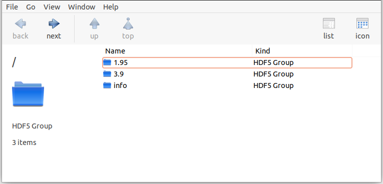
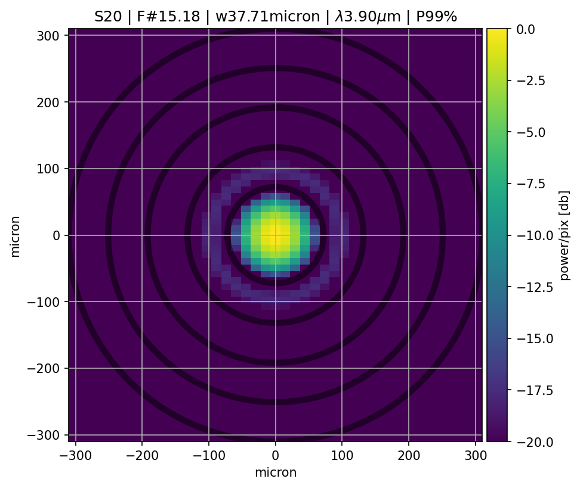

.. _Quick start:

=======================
Quick start
=======================

Short explanation on how to quickly run `PAOS` and have its output stored in a convenient file.

Running PAOS from terminal
------------------------------

The quickest way to run `PAOS` is from terminal.

Run it with the `help` flag to read the available options:

.. code-block:: bash

   $ paos --help

The main command line flags are listed in :numref:`Main command line flags`.

.. _Main command line flags:

.. list-table:: Main command line flags
   :widths: 60 100
   :header-rows: 1

   * - flag
     - description
   * - -h, --help
     - show this help message and exit
   * - -c, --configuration
     - Input configuration file to pass
   * - -o, --output
     - Output file
   * - -p, --plot
     - Save output plots
   * - -n, --nThreads
     - Number of threads for parallel processing
   * - -d, --debug
     - Debug mode screen
   * - -l, --log
     - Store the log output on file

Where the configuration file shall be an `.ini` file and the output file an `.h5` file (see later in :ref:`h5`).
`-n` must be followed by an integer. To activate `-p`, `-d` and `-l` no argument is needed.

.. note::

    `PAOS` implements the `log` submodule which makes use of the python standard module logging for output information.
    Top-level details of the calculation are output at level logging.INFO, while details of the propagation through
    each optical plane and debugging messages are printed at level logging.DEBUG. The latter can be accessed by setting
    the flag `-d`, as explained above. Set the flag `-l` to redirect the logger output to a .log textfile.

Other option flags may be given to run specific simulations, as detailed in :numref:`Other option flags`.

.. _Other option flags:

.. list-table:: Other option flags
   :widths: 60 100
   :header-rows: 1

   * - flag
     - description
   * - -wl, --wavelength
     - A list of specific wavelengths at which to run the simulation
   * - -wlg, --wavelength_grid
     - A list with min wl, max wl, spectral resolution to build a wavelength grid
   * - -wfe, --wfe_simulation
     - A list with wfe realization file and column to simulate an aberration

To have a lighter output please use the option flags listed in :numref:`Lighter output flags`.

.. _Lighter output flags:

.. list-table:: Lighter output flags
   :widths: 60 100
   :header-rows: 1

   * - flag
     - description
   * - -keys, --keys_to_keep
     - A list with the output dictionary keys to save
   * - -lo, --light_output
     - Save only at last optical surface

To activate `-lo` no argument is needed.

.. _h5:

The output file
-----------------

`PAOS` stores its main output product to a HDF5_ file (extension is `.h5` or `.hdf5`) such as that shown in :numref:`mainoutput`.
To open it, please choose your favourite viewer (e.g. HDFView_, HDFCompass_) or API (e.g. Cpp_, FORTRAN_ and Python_).

.. _mainoutput:

   `Main PAOS output file`

.. _HDF5: https://www.hdfgroup.org/solutions/hdf5/

.. _HDFView: https://www.hdfgroup.org/downloads/hdfview/

.. _HDFCompass: https://support.hdfgroup.org/projects/compass/

.. _FORTRAN: https://support.hdfgroup.org/HDF5/doc/fortran/index.html

.. _Cpp: https://support.hdfgroup.org/HDF5/doc/cpplus_RM/index.html

.. _Python: https://www.h5py.org/

For more information on how to produce a similar output file, see :ref:`Saving results`.

The baseline plot
------------------

An important part of understanding the `PAOS` output is to look at the default plot, as in :numref:`defaultplot`,
which shows the PSF, i.e. the squared amplitude of the complex wavefront, at the `AIRS-CH0` focal plane.

.. _defaultplot:

   `Baseline PAOS plot`

The title of the plot features the optical surface name, the focal number, the Gaussian beam width, the
simulation wavelength and the total optical throughput that reaches the surface.

The color scale can be either linear or logarithmic. The x and y axes are in physical units, e.g. micron.
For reference, dark circular rings are superimposed on the first five zeros of the circular Airy function.

For more information on how to produce a similar plot, see :ref:`Plotting results`.