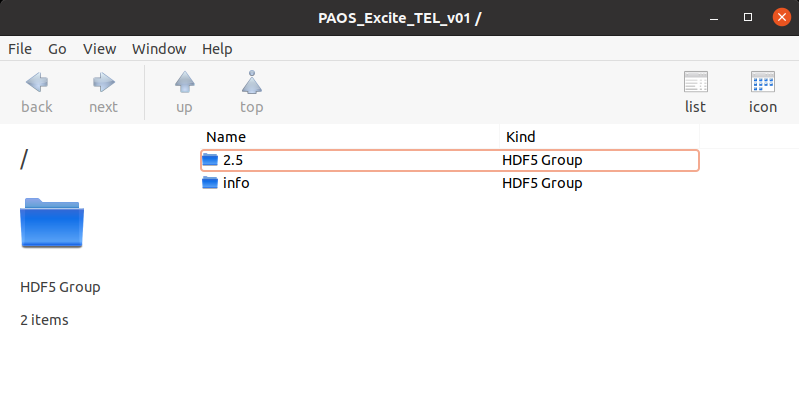

.. _Saving results:

=======================
Saving results
=======================

Save output
----------------------------

Given the POP simulation output dictionary, a hdf5 file name and the keys to store
at each surface, it saves the output dictionary along with the `PAOS` package information
to the hdf5 output file. If indicated, overwrites past output file.

.. image:: output_info.png
   :width: 600
   :align: center

.. image:: output_surfaces.png
   :width: 600
   :align: center

Example
^^^^^^^^^^^^^^^^^^^^^^^^^^^^^^^^

.. code-block:: python

        from paos.paos_parseconfig import ParseConfig
        from paos.paos_run import run
        from paos.paos_saveoutput import save_output

        pup_diameter, general, fields, opt_chain = ParseConfig('path/to/conf/file')
        ret_val = run(pup_diameter, 1.0e-6 * general['wavelength'], general['grid size'],
                  general['zoom'], fields['0'], opt_chain)
        save_output(ret_val, 'path/to/hdf5/file', keys_to_keep=['wfo', 'dx', 'dy'],
                 overwrite=True)

Save datacube
-----------------

Given a list of dictionaries with POP simulation output, a hdf5 file name, a list of
identifiers to tag each simulation and the keys to store at each surface, it saves the
outputs to a data cube along with the `PAOS` package information to the hdf5 output file.
If indicated, overwrites past output file.

.. image:: output_cube.png
   :width: 600
   :align: center

Example
^^^^^^^^^^^^^^^^^^^^^^^^^^^^^^^^

.. code-block:: python

        from paos.paos_parseconfig import ParseConfig
        from paos.paos_run import run
        from paos.paos_saveoutput import save_datacube
        from joblib import Parallel, delayed
        from tqdm import tqdm
        pup_diameter, general, fields, opt_chain = ParseConfig('path/to/conf/file')
        wavelengths = [1.95, 3.9]
        ret_val_list = Parallel(n_jobs=2)(delayed(run)(pup_diameter, 1.0e-6 * wl, general['grid size'],
                      general['zoom'], fields['0'], opt_chain) for wl in tqdm(wavelengths))
        group_tags = list(map(str, wavelengths))
        save_datacube(ret_val_list, 'path/to/hdf5/file', group_tags,
                      keys_to_keep=['amplitude', 'dx', 'dy'], overwrite=True)