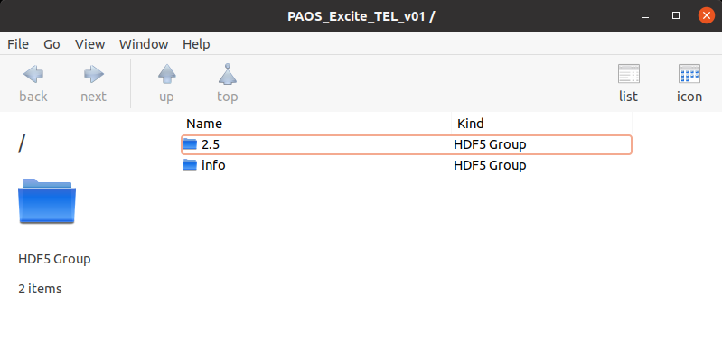
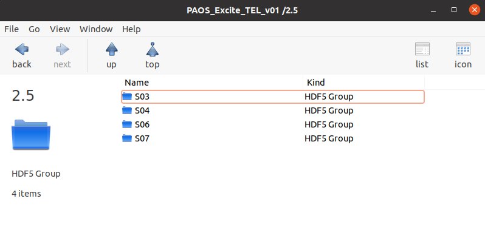
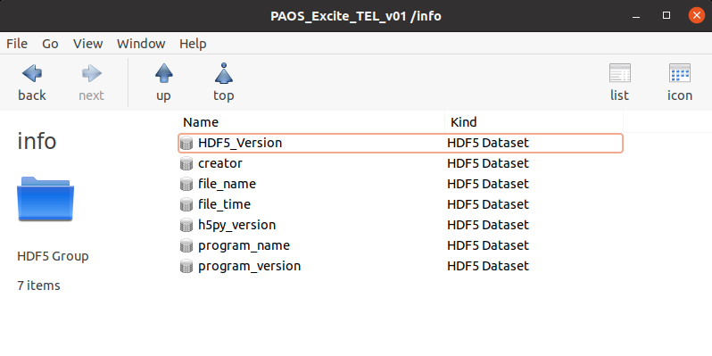
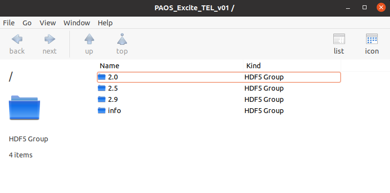

.. _Saving results:

Saving results
=======================

`PAOS` implements different saving routines, summarized here, that can be used to save the main POP simulation results.

Save output
----------------------------

The base saving method, :func:`~paos.paos_saveoutput.save_output`, receives as input the POP simulation output
dictionary, a hdf5 file name and the keys to store at each surface and saves the dictionary along with the `PAOS`
package information to the hdf5 output file. If indicated, this function overwrites a previously saved file.

The hdf5 file is structured in two sub-folders, as shown in :numref:`output_gen`. The first one is labelled with the
wavelength used in the simulation, while the other is labelled 'info'.

.. _output_gen:

   `Output file general interface`

The first folder contains a list of sub-folders, in which is stored the data relative to the individual optical
surfaces. Each surface is labelled as 'S#' where # is the surface index, as shown in :numref:`output_surfaces`.

.. _output_surfaces:

   `Output file surfaces interface`

The 'info' folder contains the data that are needed for traceability and versioning of the results, as shown in :numref:`output_info`.

This includes:

#. The HDF5 package version
#. The `PAOS` creator names
#. The saving path
#. The saving time in human readable format
#. The h5py version
#. This package's name
#. This package's version

.. _output_info:

   `Output file info interface`

Example
~~~~~~~~~

Code example to use :func:`~paos.paos_saveoutput.save_output` to save the POP simulation output dictionary.

The user can select to save only the relevant dictionary keys, here 'wfo' (the complex wavefront array), 'dx' (the
sampling along the horizontal axis), 'dy' (the sampling along the vertical axis).

.. code-block:: python

        from paos.paos_saveoutput import save_output
        save_output(ret_val,
                    file_name='path/to/hdf5',
                    keys_to_keep=['wfo', 'dx', 'dy'],
                    overwrite=True)

Save datacube
-----------------

The :func:`~paos.paos_saveoutput.save_datacube` method receives as input a list of output dictionaries for each POP
simulation, a hdf5 file name, a list of identifiers to tag each simulation and the relevant keys to store at each
surface, and saves all the outputs to a data cube stored in the hdf5 output file. If indicated, this method
overwrites a previously saved file.

:numref:`output_cube`

.. _output_cube:

   `Output file cube general interface`

Example
~~~~~~~~~

Code example to use :func:`~paos.paos_saveoutput.save_datacube` to save the output dictionary for multiple POP
simulations done at different wavelengths.

The user can select to save only the relevant dictionary keys, here 'amplitude' (the wavefront amplitude), 'dx' (the
sampling along the horizontal axis), 'dy' (the sampling along the vertical axis).

.. code-block:: python

        from paos.paos_saveoutput import save_datacube

        save_datacube(retval_list=ret_val_list,
                      file_name='path/to/hdf5',
                      group_names=['2.5', '3.0'],
                      keys_to_keep=['amplitude', 'dx', 'dy'],
                      overwrite=True)