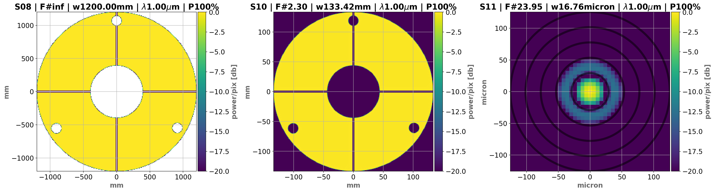
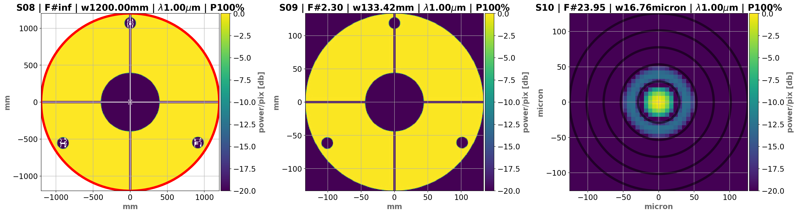
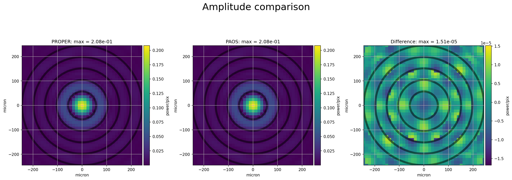
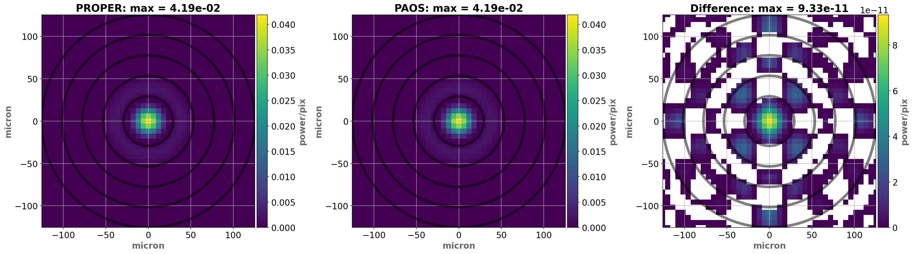

.. _Validation:

Validation
=======================

`PAOS` has been validated against the code PROPER
(`John E. Krist, PROPER: an optical propagation library for IDL, Proc. SPIE, 6675 (2007) <https://doi.org/10.1117/12.731179>`_),
a library of optical propagation procedures and functions for the IDL (Interactive Data Language), Python,
and Matlab environments.

The validation has been carried out using the Hubble Space Telescope (HST) optical chain as described in one of PROPER
example prescriptions. The corresponding configuration file is provided in the `PAOS` package for reproducibility.

The input pupil is uniformly illuminated and is apodized by the primary mirror circular pads (1, 2, and 3), the secondary
mirror circular obscuration and rectangular vanes (vertical and horizontal). From M1, the wavefront is propagated to the
secondary mirror (M2), then it is brought to the HST focus.

Below, we show the plots for the squared amplitude of the wavefront at all surfaces along the HST optical chain, using
`PROPER` (:numref:`PROPER HST`) and `PAOS` (:numref:`PAOS HST`).

.. _PROPER HST:

   `PROPER HST`

.. _PAOS HST:

   `PAOS HST`

For the validation, we compared the amplitude (:numref:`Amplitude_comparison`), phase (:numref:`Phase_comparison`) and
PSF (:numref:`PSF_comparison`) at the HST focus as obtained by `PROPER` and `PAOS`, along with their differences.
The comparison shows excellent agreement, and small discrepancies (PSF: :math:`< 10 ^{-10}`) between the two codes are
mostly due to aliasing from the aperture masks.

.. note::
    The phase convention used in the two codes differs by a sign, therefore in the comparison the `PAOS` phase is
    multiplied by :math:`-1`. Moreover, the maximum value of the difference is due to individual aliased pixels far from the
    beam axis.

.. _Amplitude_comparison:

   `Amplitude comparison`

.. _Phase_comparison:
.. figure:: Phase_comparison.png
   :width: 900
   :align: center

   `Phase comparison`

.. _Psf_comparison:

   `PSF comparison`

